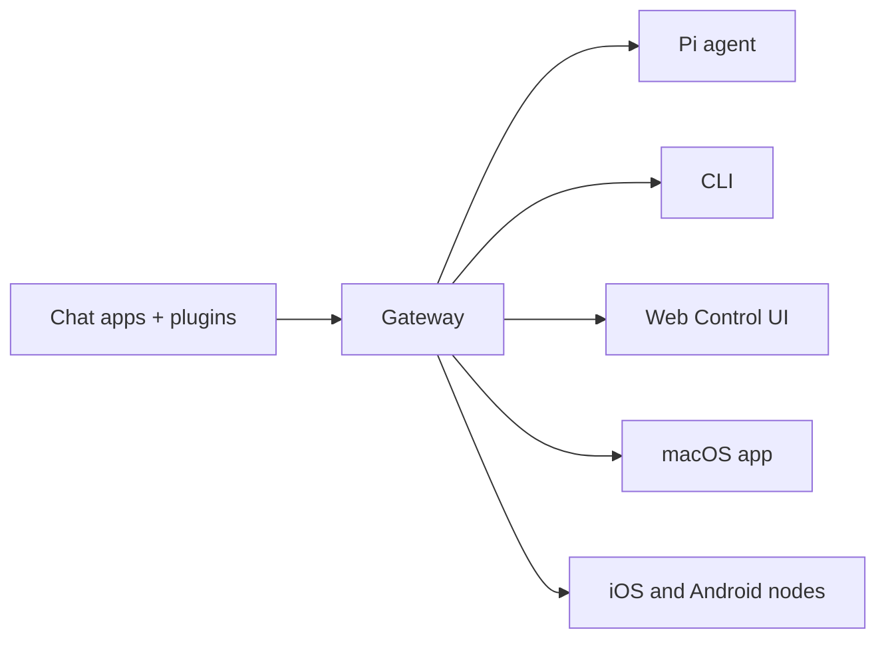

# General

Source category: `General`

Files included: 11

---

## File: `auth-credential-semantics.md`

Source URL: https://docs.openclaw.ai/auth-credential-semantics.md

---

> ## Documentation Index
> Fetch the complete documentation index at: https://docs.openclaw.ai/llms.txt
> Use this file to discover all available pages before exploring further.

# Auth credential semantics

# Auth Credential Semantics

This document defines the canonical credential eligibility and resolution semantics used across:

* `resolveAuthProfileOrder`
* `resolveApiKeyForProfile`
* `models status --probe`
* `doctor-auth`

The goal is to keep selection-time and runtime behavior aligned.

## Stable Reason Codes

* `ok`
* `missing_credential`
* `invalid_expires`
* `expired`
* `unresolved_ref`

## Token Credentials

Token credentials (`type: "token"`) support inline `token` and/or `tokenRef`.

### Eligibility rules

1. A token profile is ineligible when both `token` and `tokenRef` are absent.
2. `expires` is optional.
3. If `expires` is present, it must be a finite number greater than `0`.
4. If `expires` is invalid (`NaN`, `0`, negative, non-finite, or wrong type), the profile is ineligible with `invalid_expires`.
5. If `expires` is in the past, the profile is ineligible with `expired`.
6. `tokenRef` does not bypass `expires` validation.

### Resolution rules

1. Resolver semantics match eligibility semantics for `expires`.
2. For eligible profiles, token material may be resolved from inline value or `tokenRef`.
3. Unresolvable refs produce `unresolved_ref` in `models status --probe` output.

## Legacy-Compatible Messaging

For script compatibility, probe errors keep this first line unchanged:

`Auth profile credentials are missing or expired.`

Human-friendly detail and stable reason codes may be added on subsequent lines.


Built with [Mintlify](https://mintlify.com).

---

## File: `brave-search.md`

Source URL: https://docs.openclaw.ai/brave-search.md

---

> ## Documentation Index
> Fetch the complete documentation index at: https://docs.openclaw.ai/llms.txt
> Use this file to discover all available pages before exploring further.

# Brave Search

# Brave Search API

OpenClaw supports Brave Search API as a `web_search` provider.

## Get an API key

1. Create a Brave Search API account at [https://brave.com/search/api/](https://brave.com/search/api/)
2. In the dashboard, choose the **Search** plan and generate an API key.
3. Store the key in config or set `BRAVE_API_KEY` in the Gateway environment.

## Config example

```json5  theme={"theme":{"light":"min-light","dark":"min-dark"}}
{
  tools: {
    web: {
      search: {
        provider: "brave",
        apiKey: "BRAVE_API_KEY_HERE",
        maxResults: 5,
        timeoutSeconds: 30,
      },
    },
  },
}
```

## Tool parameters

| Parameter     | Description                                                         |
| ------------- | ------------------------------------------------------------------- |
| `query`       | Search query (required)                                             |
| `count`       | Number of results to return (1-10, default: 5)                      |
| `country`     | 2-letter ISO country code (e.g., "US", "DE")                        |
| `language`    | ISO 639-1 language code for search results (e.g., "en", "de", "fr") |
| `ui_lang`     | ISO language code for UI elements                                   |
| `freshness`   | Time filter: `day` (24h), `week`, `month`, or `year`                |
| `date_after`  | Only results published after this date (YYYY-MM-DD)                 |
| `date_before` | Only results published before this date (YYYY-MM-DD)                |

**Examples:**

```javascript  theme={"theme":{"light":"min-light","dark":"min-dark"}}
// Country and language-specific search
await web_search({
  query: "renewable energy",
  country: "DE",
  language: "de",
});

// Recent results (past week)
await web_search({
  query: "AI news",
  freshness: "week",
});

// Date range search
await web_search({
  query: "AI developments",
  date_after: "2024-01-01",
  date_before: "2024-06-30",
});
```

## Notes

* OpenClaw uses the Brave **Search** plan. If you have a legacy subscription (e.g. the original Free plan with 2,000 queries/month), it remains valid but does not include newer features like LLM Context or higher rate limits.
* Each Brave plan includes \*\*$5/month in free credit** (renewing). The Search plan costs $5 per 1,000 requests, so the credit covers 1,000 queries/month. Set your usage limit in the Brave dashboard to avoid unexpected charges. See the [Brave API portal](https://brave.com/search/api/) for current plans.
* The Search plan includes the LLM Context endpoint and AI inference rights. Storing results to train or tune models requires a plan with explicit storage rights. See the Brave [Terms of Service](https://api-dashboard.search.brave.com/terms-of-service).
* Results are cached for 15 minutes by default (configurable via `cacheTtlMinutes`).

See [Web tools](/tools/web) for the full web\_search configuration.


Built with [Mintlify](https://mintlify.com).

---

## File: `ci.md`

Source URL: https://docs.openclaw.ai/ci.md

---

> ## Documentation Index
> Fetch the complete documentation index at: https://docs.openclaw.ai/llms.txt
> Use this file to discover all available pages before exploring further.

# CI Pipeline

> How the OpenClaw CI pipeline works

# CI Pipeline

The CI runs on every push to `main` and every pull request. It uses smart scoping to skip expensive jobs when only docs or native code changed.

## Job Overview

| Job               | Purpose                                                 | When it runs                                      |
| ----------------- | ------------------------------------------------------- | ------------------------------------------------- |
| `docs-scope`      | Detect docs-only changes                                | Always                                            |
| `changed-scope`   | Detect which areas changed (node/macos/android/windows) | Non-docs PRs                                      |
| `check`           | TypeScript types, lint, format                          | Push to `main`, or PRs with Node-relevant changes |
| `check-docs`      | Markdown lint + broken link check                       | Docs changed                                      |
| `code-analysis`   | LOC threshold check (1000 lines)                        | PRs only                                          |
| `secrets`         | Detect leaked secrets                                   | Always                                            |
| `build-artifacts` | Build dist once, share with other jobs                  | Non-docs, node changes                            |
| `release-check`   | Validate npm pack contents                              | After build                                       |
| `checks`          | Node/Bun tests + protocol check                         | Non-docs, node changes                            |
| `checks-windows`  | Windows-specific tests                                  | Non-docs, windows-relevant changes                |
| `macos`           | Swift lint/build/test + TS tests                        | PRs with macos changes                            |
| `android`         | Gradle build + tests                                    | Non-docs, android changes                         |

## Fail-Fast Order

Jobs are ordered so cheap checks fail before expensive ones run:

1. `docs-scope` + `code-analysis` + `check` (parallel, \~1-2 min)
2. `build-artifacts` (blocked on above)
3. `checks`, `checks-windows`, `macos`, `android` (blocked on build)

Scope logic lives in `scripts/ci-changed-scope.mjs` and is covered by unit tests in `src/scripts/ci-changed-scope.test.ts`.

## Runners

| Runner                           | Jobs                                       |
| -------------------------------- | ------------------------------------------ |
| `blacksmith-16vcpu-ubuntu-2404`  | Most Linux jobs, including scope detection |
| `blacksmith-32vcpu-windows-2025` | `checks-windows`                           |
| `macos-latest`                   | `macos`, `ios`                             |

## Local Equivalents

```bash  theme={"theme":{"light":"min-light","dark":"min-dark"}}
pnpm check          # types + lint + format
pnpm test           # vitest tests
pnpm check:docs     # docs format + lint + broken links
pnpm release:check  # validate npm pack
```


Built with [Mintlify](https://mintlify.com).

---

## File: `date-time.md`

Source URL: https://docs.openclaw.ai/date-time.md

---

> ## Documentation Index
> Fetch the complete documentation index at: https://docs.openclaw.ai/llms.txt
> Use this file to discover all available pages before exploring further.

# Date and Time

# Date & Time

OpenClaw defaults to **host-local time for transport timestamps** and **user timezone only in the system prompt**.
Provider timestamps are preserved so tools keep their native semantics (current time is available via `session_status`).

## Message envelopes (local by default)

Inbound messages are wrapped with a timestamp (minute precision):

```
[Provider ... 2026-01-05 16:26 PST] message text
```

This envelope timestamp is **host-local by default**, regardless of the provider timezone.

You can override this behavior:

```json5  theme={"theme":{"light":"min-light","dark":"min-dark"}}
{
  agents: {
    defaults: {
      envelopeTimezone: "local", // "utc" | "local" | "user" | IANA timezone
      envelopeTimestamp: "on", // "on" | "off"
      envelopeElapsed: "on", // "on" | "off"
    },
  },
}
```

* `envelopeTimezone: "utc"` uses UTC.
* `envelopeTimezone: "local"` uses the host timezone.
* `envelopeTimezone: "user"` uses `agents.defaults.userTimezone` (falls back to host timezone).
* Use an explicit IANA timezone (e.g., `"America/Chicago"`) for a fixed zone.
* `envelopeTimestamp: "off"` removes absolute timestamps from envelope headers.
* `envelopeElapsed: "off"` removes elapsed time suffixes (the `+2m` style).

### Examples

**Local (default):**

```
[WhatsApp +1555 2026-01-18 00:19 PST] hello
```

**User timezone:**

```
[WhatsApp +1555 2026-01-18 00:19 CST] hello
```

**Elapsed time enabled:**

```
[WhatsApp +1555 +30s 2026-01-18T05:19Z] follow-up
```

## System prompt: Current Date & Time

If the user timezone is known, the system prompt includes a dedicated
**Current Date & Time** section with the **time zone only** (no clock/time format)
to keep prompt caching stable:

```
Time zone: America/Chicago
```

When the agent needs the current time, use the `session_status` tool; the status
card includes a timestamp line.

## System event lines (local by default)

Queued system events inserted into agent context are prefixed with a timestamp using the
same timezone selection as message envelopes (default: host-local).

```
System: [2026-01-12 12:19:17 PST] Model switched.
```

### Configure user timezone + format

```json5  theme={"theme":{"light":"min-light","dark":"min-dark"}}
{
  agents: {
    defaults: {
      userTimezone: "America/Chicago",
      timeFormat: "auto", // auto | 12 | 24
    },
  },
}
```

* `userTimezone` sets the **user-local timezone** for prompt context.
* `timeFormat` controls **12h/24h display** in the prompt. `auto` follows OS prefs.

## Time format detection (auto)

When `timeFormat: "auto"`, OpenClaw inspects the OS preference (macOS/Windows)
and falls back to locale formatting. The detected value is **cached per process**
to avoid repeated system calls.

## Tool payloads + connectors (raw provider time + normalized fields)

Channel tools return **provider-native timestamps** and add normalized fields for consistency:

* `timestampMs`: epoch milliseconds (UTC)
* `timestampUtc`: ISO 8601 UTC string

Raw provider fields are preserved so nothing is lost.

* Slack: epoch-like strings from the API
* Discord: UTC ISO timestamps
* Telegram/WhatsApp: provider-specific numeric/ISO timestamps

If you need local time, convert it downstream using the known timezone.

## Related docs

* [System Prompt](/concepts/system-prompt)
* [Timezones](/concepts/timezone)
* [Messages](/concepts/messages)


Built with [Mintlify](https://mintlify.com).

---

## File: `index.md`

Source URL: https://docs.openclaw.ai/index.md

---

> ## Documentation Index
> Fetch the complete documentation index at: https://docs.openclaw.ai/llms.txt
> Use this file to discover all available pages before exploring further.

# OpenClaw

# OpenClaw 🦞

<p align="center">
  

  
</p>

> *"EXFOLIATE! EXFOLIATE!"* — A space lobster, probably

<p align="center">
  <strong>Any OS gateway for AI agents across WhatsApp, Telegram, Discord, iMessage, and more.</strong><br />
  Send a message, get an agent response from your pocket. Plugins add Mattermost and more.
</p>

<Columns>
  <Card title="Get Started" href="/start/getting-started" icon="rocket">
    Install OpenClaw and bring up the Gateway in minutes.
  </Card>

  <Card title="Run the Wizard" href="/start/wizard" icon="sparkles">
    Guided setup with `openclaw onboard` and pairing flows.
  </Card>

  <Card title="Open the Control UI" href="/web/control-ui" icon="layout-dashboard">
    Launch the browser dashboard for chat, config, and sessions.
  </Card>
</Columns>

## What is OpenClaw?

OpenClaw is a **self-hosted gateway** that connects your favorite chat apps — WhatsApp, Telegram, Discord, iMessage, and more — to AI coding agents like Pi. You run a single Gateway process on your own machine (or a server), and it becomes the bridge between your messaging apps and an always-available AI assistant.

**Who is it for?** Developers and power users who want a personal AI assistant they can message from anywhere — without giving up control of their data or relying on a hosted service.

**What makes it different?**

* **Self-hosted**: runs on your hardware, your rules
* **Multi-channel**: one Gateway serves WhatsApp, Telegram, Discord, and more simultaneously
* **Agent-native**: built for coding agents with tool use, sessions, memory, and multi-agent routing
* **Open source**: MIT licensed, community-driven

**What do you need?** Node 22+, an API key from your chosen provider, and 5 minutes. For best quality and security, use the strongest latest-generation model available.

## How it works



The Gateway is the single source of truth for sessions, routing, and channel connections.

## Key capabilities

<Columns>
  <Card title="Multi-channel gateway" icon="network">
    WhatsApp, Telegram, Discord, and iMessage with a single Gateway process.
  </Card>

  <Card title="Plugin channels" icon="plug">
    Add Mattermost and more with extension packages.
  </Card>

  <Card title="Multi-agent routing" icon="route">
    Isolated sessions per agent, workspace, or sender.
  </Card>

  <Card title="Media support" icon="image">
    Send and receive images, audio, and documents.
  </Card>

  <Card title="Web Control UI" icon="monitor">
    Browser dashboard for chat, config, sessions, and nodes.
  </Card>

  <Card title="Mobile nodes" icon="smartphone">
    Pair iOS and Android nodes for Canvas, camera, and voice-enabled workflows.
  </Card>
</Columns>

## Quick start

<Steps>
  <Step title="Install OpenClaw">
    ```bash  theme={"theme":{"light":"min-light","dark":"min-dark"}}
    npm install -g openclaw@latest
    ```
  </Step>

  <Step title="Onboard and install the service">
    ```bash  theme={"theme":{"light":"min-light","dark":"min-dark"}}
    openclaw onboard --install-daemon
    ```
  </Step>

  <Step title="Pair WhatsApp and start the Gateway">
    ```bash  theme={"theme":{"light":"min-light","dark":"min-dark"}}
    openclaw channels login
    openclaw gateway --port 18789
    ```
  </Step>
</Steps>

Need the full install and dev setup? See [Quick start](/start/quickstart).

## Dashboard

Open the browser Control UI after the Gateway starts.

* Local default: [http://127.0.0.1:18789/](http://127.0.0.1:18789/)
* Remote access: [Web surfaces](/web) and [Tailscale](/gateway/tailscale)

<p align="center">
  
</p>

## Configuration (optional)

Config lives at `~/.openclaw/openclaw.json`.

* If you **do nothing**, OpenClaw uses the bundled Pi binary in RPC mode with per-sender sessions.
* If you want to lock it down, start with `channels.whatsapp.allowFrom` and (for groups) mention rules.

Example:

```json5  theme={"theme":{"light":"min-light","dark":"min-dark"}}
{
  channels: {
    whatsapp: {
      allowFrom: ["+15555550123"],
      groups: { "*": { requireMention: true } },
    },
  },
  messages: { groupChat: { mentionPatterns: ["@openclaw"] } },
}
```

## Start here

<Columns>
  <Card title="Docs hubs" href="/start/hubs" icon="book-open">
    All docs and guides, organized by use case.
  </Card>

  <Card title="Configuration" href="/gateway/configuration" icon="settings">
    Core Gateway settings, tokens, and provider config.
  </Card>

  <Card title="Remote access" href="/gateway/remote" icon="globe">
    SSH and tailnet access patterns.
  </Card>

  <Card title="Channels" href="/channels/telegram" icon="message-square">
    Channel-specific setup for WhatsApp, Telegram, Discord, and more.
  </Card>

  <Card title="Nodes" href="/nodes" icon="smartphone">
    iOS and Android nodes with pairing, Canvas, camera, and device actions.
  </Card>

  <Card title="Help" href="/help" icon="life-buoy">
    Common fixes and troubleshooting entry point.
  </Card>
</Columns>

## Learn more

<Columns>
  <Card title="Full feature list" href="/concepts/features" icon="list">
    Complete channel, routing, and media capabilities.
  </Card>

  <Card title="Multi-agent routing" href="/concepts/multi-agent" icon="route">
    Workspace isolation and per-agent sessions.
  </Card>

  <Card title="Security" href="/gateway/security" icon="shield">
    Tokens, allowlists, and safety controls.
  </Card>

  <Card title="Troubleshooting" href="/gateway/troubleshooting" icon="wrench">
    Gateway diagnostics and common errors.
  </Card>

  <Card title="About and credits" href="/reference/credits" icon="info">
    Project origins, contributors, and license.
  </Card>
</Columns>


Built with [Mintlify](https://mintlify.com).

---

## File: `perplexity.md`

Source URL: https://docs.openclaw.ai/perplexity.md

---

> ## Documentation Index
> Fetch the complete documentation index at: https://docs.openclaw.ai/llms.txt
> Use this file to discover all available pages before exploring further.

# Perplexity Sonar

# Perplexity Sonar

OpenClaw can use Perplexity Sonar for the `web_search` tool. You can connect
through Perplexity’s direct API or via OpenRouter.

## API options

### Perplexity (direct)

* Base URL: [https://api.perplexity.ai](https://api.perplexity.ai)
* Environment variable: `PERPLEXITY_API_KEY`

### OpenRouter (alternative)

* Base URL: [https://openrouter.ai/api/v1](https://openrouter.ai/api/v1)
* Environment variable: `OPENROUTER_API_KEY`
* Supports prepaid/crypto credits.

## Config example

```json5  theme={"theme":{"light":"min-light","dark":"min-dark"}}
{
  tools: {
    web: {
      search: {
        provider: "perplexity",
        perplexity: {
          apiKey: "pplx-...",
          baseUrl: "https://api.perplexity.ai",
          model: "perplexity/sonar-pro",
        },
      },
    },
  },
}
```

## Switching from Brave

```json5  theme={"theme":{"light":"min-light","dark":"min-dark"}}
{
  tools: {
    web: {
      search: {
        provider: "perplexity",
        perplexity: {
          apiKey: "pplx-...",
          baseUrl: "https://api.perplexity.ai",
        },
      },
    },
  },
}
```

If both `PERPLEXITY_API_KEY` and `OPENROUTER_API_KEY` are set, set
`tools.web.search.perplexity.baseUrl` (or `tools.web.search.perplexity.apiKey`)
to disambiguate.

If no base URL is set, OpenClaw chooses a default based on the API key source:

* `PERPLEXITY_API_KEY` or `pplx-...` → direct Perplexity (`https://api.perplexity.ai`)
* `OPENROUTER_API_KEY` or `sk-or-...` → OpenRouter (`https://openrouter.ai/api/v1`)
* Unknown key formats → OpenRouter (safe fallback)

## Models

* `perplexity/sonar` — fast Q\&A with web search
* `perplexity/sonar-pro` (default) — multi-step reasoning + web search
* `perplexity/sonar-reasoning-pro` — deep research

See [Web tools](/tools/web) for the full web\_search configuration.


Built with [Mintlify](https://mintlify.com).

---

## File: `pi.md`

Source URL: https://docs.openclaw.ai/pi.md

---

> ## Documentation Index
> Fetch the complete documentation index at: https://docs.openclaw.ai/llms.txt
> Use this file to discover all available pages before exploring further.

# Pi Integration Architecture

# Pi Integration Architecture

This document describes how OpenClaw integrates with [pi-coding-agent](https://github.com/badlogic/pi-mono/tree/main/packages/coding-agent) and its sibling packages (`pi-ai`, `pi-agent-core`, `pi-tui`) to power its AI agent capabilities.

## Overview

OpenClaw uses the pi SDK to embed an AI coding agent into its messaging gateway architecture. Instead of spawning pi as a subprocess or using RPC mode, OpenClaw directly imports and instantiates pi's `AgentSession` via `createAgentSession()`. This embedded approach provides:

* Full control over session lifecycle and event handling
* Custom tool injection (messaging, sandbox, channel-specific actions)
* System prompt customization per channel/context
* Session persistence with branching/compaction support
* Multi-account auth profile rotation with failover
* Provider-agnostic model switching

## Package Dependencies

```json  theme={"theme":{"light":"min-light","dark":"min-dark"}}
{
  "@mariozechner/pi-agent-core": "0.49.3",
  "@mariozechner/pi-ai": "0.49.3",
  "@mariozechner/pi-coding-agent": "0.49.3",
  "@mariozechner/pi-tui": "0.49.3"
}
```

| Package           | Purpose                                                                                                |
| ----------------- | ------------------------------------------------------------------------------------------------------ |
| `pi-ai`           | Core LLM abstractions: `Model`, `streamSimple`, message types, provider APIs                           |
| `pi-agent-core`   | Agent loop, tool execution, `AgentMessage` types                                                       |
| `pi-coding-agent` | High-level SDK: `createAgentSession`, `SessionManager`, `AuthStorage`, `ModelRegistry`, built-in tools |
| `pi-tui`          | Terminal UI components (used in OpenClaw's local TUI mode)                                             |

## File Structure

```
src/agents/
├── pi-embedded-runner.ts          # Re-exports from pi-embedded-runner/
├── pi-embedded-runner/
│   ├── run.ts                     # Main entry: runEmbeddedPiAgent()
│   ├── run/
│   │   ├── attempt.ts             # Single attempt logic with session setup
│   │   ├── params.ts              # RunEmbeddedPiAgentParams type
│   │   ├── payloads.ts            # Build response payloads from run results
│   │   ├── images.ts              # Vision model image injection
│   │   └── types.ts               # EmbeddedRunAttemptResult
│   ├── abort.ts                   # Abort error detection
│   ├── cache-ttl.ts               # Cache TTL tracking for context pruning
│   ├── compact.ts                 # Manual/auto compaction logic
│   ├── extensions.ts              # Load pi extensions for embedded runs
│   ├── extra-params.ts            # Provider-specific stream params
│   ├── google.ts                  # Google/Gemini turn ordering fixes
│   ├── history.ts                 # History limiting (DM vs group)
│   ├── lanes.ts                   # Session/global command lanes
│   ├── logger.ts                  # Subsystem logger
│   ├── model.ts                   # Model resolution via ModelRegistry
│   ├── runs.ts                    # Active run tracking, abort, queue
│   ├── sandbox-info.ts            # Sandbox info for system prompt
│   ├── session-manager-cache.ts   # SessionManager instance caching
│   ├── session-manager-init.ts    # Session file initialization
│   ├── system-prompt.ts           # System prompt builder
│   ├── tool-split.ts              # Split tools into builtIn vs custom
│   ├── types.ts                   # EmbeddedPiAgentMeta, EmbeddedPiRunResult
│   └── utils.ts                   # ThinkLevel mapping, error description
├── pi-embedded-subscribe.ts       # Session event subscription/dispatch
├── pi-embedded-subscribe.types.ts # SubscribeEmbeddedPiSessionParams
├── pi-embedded-subscribe.handlers.ts # Event handler factory
├── pi-embedded-subscribe.handlers.lifecycle.ts
├── pi-embedded-subscribe.handlers.types.ts
├── pi-embedded-block-chunker.ts   # Streaming block reply chunking
├── pi-embedded-messaging.ts       # Messaging tool sent tracking
├── pi-embedded-helpers.ts         # Error classification, turn validation
├── pi-embedded-helpers/           # Helper modules
├── pi-embedded-utils.ts           # Formatting utilities
├── pi-tools.ts                    # createOpenClawCodingTools()
├── pi-tools.abort.ts              # AbortSignal wrapping for tools
├── pi-tools.policy.ts             # Tool allowlist/denylist policy
├── pi-tools.read.ts               # Read tool customizations
├── pi-tools.schema.ts             # Tool schema normalization
├── pi-tools.types.ts              # AnyAgentTool type alias
├── pi-tool-definition-adapter.ts  # AgentTool -> ToolDefinition adapter
├── pi-settings.ts                 # Settings overrides
├── pi-extensions/                 # Custom pi extensions
│   ├── compaction-safeguard.ts    # Safeguard extension
│   ├── compaction-safeguard-runtime.ts
│   ├── context-pruning.ts         # Cache-TTL context pruning extension
│   └── context-pruning/
├── model-auth.ts                  # Auth profile resolution
├── auth-profiles.ts               # Profile store, cooldown, failover
├── model-selection.ts             # Default model resolution
├── models-config.ts               # models.json generation
├── model-catalog.ts               # Model catalog cache
├── context-window-guard.ts        # Context window validation
├── failover-error.ts              # FailoverError class
├── defaults.ts                    # DEFAULT_PROVIDER, DEFAULT_MODEL
├── system-prompt.ts               # buildAgentSystemPrompt()
├── system-prompt-params.ts        # System prompt parameter resolution
├── system-prompt-report.ts        # Debug report generation
├── tool-summaries.ts              # Tool description summaries
├── tool-policy.ts                 # Tool policy resolution
├── transcript-policy.ts           # Transcript validation policy
├── skills.ts                      # Skill snapshot/prompt building
├── skills/                        # Skill subsystem
├── sandbox.ts                     # Sandbox context resolution
├── sandbox/                       # Sandbox subsystem
├── channel-tools.ts               # Channel-specific tool injection
├── openclaw-tools.ts              # OpenClaw-specific tools
├── bash-tools.ts                  # exec/process tools
├── apply-patch.ts                 # apply_patch tool (OpenAI)
├── tools/                         # Individual tool implementations
│   ├── browser-tool.ts
│   ├── canvas-tool.ts
│   ├── cron-tool.ts
│   ├── discord-actions*.ts
│   ├── gateway-tool.ts
│   ├── image-tool.ts
│   ├── message-tool.ts
│   ├── nodes-tool.ts
│   ├── session*.ts
│   ├── slack-actions.ts
│   ├── telegram-actions.ts
│   ├── web-*.ts
│   └── whatsapp-actions.ts
└── ...
```

## Core Integration Flow

### 1. Running an Embedded Agent

The main entry point is `runEmbeddedPiAgent()` in `pi-embedded-runner/run.ts`:

```typescript  theme={"theme":{"light":"min-light","dark":"min-dark"}}
import { runEmbeddedPiAgent } from "./agents/pi-embedded-runner.js";

const result = await runEmbeddedPiAgent({
  sessionId: "user-123",
  sessionKey: "main:whatsapp:+1234567890",
  sessionFile: "/path/to/session.jsonl",
  workspaceDir: "/path/to/workspace",
  config: openclawConfig,
  prompt: "Hello, how are you?",
  provider: "anthropic",
  model: "claude-sonnet-4-20250514",
  timeoutMs: 120_000,
  runId: "run-abc",
  onBlockReply: async (payload) => {
    await sendToChannel(payload.text, payload.mediaUrls);
  },
});
```

### 2. Session Creation

Inside `runEmbeddedAttempt()` (called by `runEmbeddedPiAgent()`), the pi SDK is used:

```typescript  theme={"theme":{"light":"min-light","dark":"min-dark"}}
import {
  createAgentSession,
  DefaultResourceLoader,
  SessionManager,
  SettingsManager,
} from "@mariozechner/pi-coding-agent";

const resourceLoader = new DefaultResourceLoader({
  cwd: resolvedWorkspace,
  agentDir,
  settingsManager,
  additionalExtensionPaths,
});
await resourceLoader.reload();

const { session } = await createAgentSession({
  cwd: resolvedWorkspace,
  agentDir,
  authStorage: params.authStorage,
  modelRegistry: params.modelRegistry,
  model: params.model,
  thinkingLevel: mapThinkingLevel(params.thinkLevel),
  tools: builtInTools,
  customTools: allCustomTools,
  sessionManager,
  settingsManager,
  resourceLoader,
});

applySystemPromptOverrideToSession(session, systemPromptOverride);
```

### 3. Event Subscription

`subscribeEmbeddedPiSession()` subscribes to pi's `AgentSession` events:

```typescript  theme={"theme":{"light":"min-light","dark":"min-dark"}}
const subscription = subscribeEmbeddedPiSession({
  session: activeSession,
  runId: params.runId,
  verboseLevel: params.verboseLevel,
  reasoningMode: params.reasoningLevel,
  toolResultFormat: params.toolResultFormat,
  onToolResult: params.onToolResult,
  onReasoningStream: params.onReasoningStream,
  onBlockReply: params.onBlockReply,
  onPartialReply: params.onPartialReply,
  onAgentEvent: params.onAgentEvent,
});
```

Events handled include:

* `message_start` / `message_end` / `message_update` (streaming text/thinking)
* `tool_execution_start` / `tool_execution_update` / `tool_execution_end`
* `turn_start` / `turn_end`
* `agent_start` / `agent_end`
* `auto_compaction_start` / `auto_compaction_end`

### 4. Prompting

After setup, the session is prompted:

```typescript  theme={"theme":{"light":"min-light","dark":"min-dark"}}
await session.prompt(effectivePrompt, { images: imageResult.images });
```

The SDK handles the full agent loop: sending to LLM, executing tool calls, streaming responses.

Image injection is prompt-local: OpenClaw loads image refs from the current prompt and
passes them via `images` for that turn only. It does not re-scan older history turns
to re-inject image payloads.

## Tool Architecture

### Tool Pipeline

1. **Base Tools**: pi's `codingTools` (read, bash, edit, write)
2. **Custom Replacements**: OpenClaw replaces bash with `exec`/`process`, customizes read/edit/write for sandbox
3. **OpenClaw Tools**: messaging, browser, canvas, sessions, cron, gateway, etc.
4. **Channel Tools**: Discord/Telegram/Slack/WhatsApp-specific action tools
5. **Policy Filtering**: Tools filtered by profile, provider, agent, group, sandbox policies
6. **Schema Normalization**: Schemas cleaned for Gemini/OpenAI quirks
7. **AbortSignal Wrapping**: Tools wrapped to respect abort signals

### Tool Definition Adapter

pi-agent-core's `AgentTool` has a different `execute` signature than pi-coding-agent's `ToolDefinition`. The adapter in `pi-tool-definition-adapter.ts` bridges this:

```typescript  theme={"theme":{"light":"min-light","dark":"min-dark"}}
export function toToolDefinitions(tools: AnyAgentTool[]): ToolDefinition[] {
  return tools.map((tool) => ({
    name: tool.name,
    label: tool.label ?? name,
    description: tool.description ?? "",
    parameters: tool.parameters,
    execute: async (toolCallId, params, onUpdate, _ctx, signal) => {
      // pi-coding-agent signature differs from pi-agent-core
      return await tool.execute(toolCallId, params, signal, onUpdate);
    },
  }));
}
```

### Tool Split Strategy

`splitSdkTools()` passes all tools via `customTools`:

```typescript  theme={"theme":{"light":"min-light","dark":"min-dark"}}
export function splitSdkTools(options: { tools: AnyAgentTool[]; sandboxEnabled: boolean }) {
  return {
    builtInTools: [], // Empty. We override everything
    customTools: toToolDefinitions(options.tools),
  };
}
```

This ensures OpenClaw's policy filtering, sandbox integration, and extended toolset remain consistent across providers.

## System Prompt Construction

The system prompt is built in `buildAgentSystemPrompt()` (`system-prompt.ts`). It assembles a full prompt with sections including Tooling, Tool Call Style, Safety guardrails, OpenClaw CLI reference, Skills, Docs, Workspace, Sandbox, Messaging, Reply Tags, Voice, Silent Replies, Heartbeats, Runtime metadata, plus Memory and Reactions when enabled, and optional context files and extra system prompt content. Sections are trimmed for minimal prompt mode used by subagents.

The prompt is applied after session creation via `applySystemPromptOverrideToSession()`:

```typescript  theme={"theme":{"light":"min-light","dark":"min-dark"}}
const systemPromptOverride = createSystemPromptOverride(appendPrompt);
applySystemPromptOverrideToSession(session, systemPromptOverride);
```

## Session Management

### Session Files

Sessions are JSONL files with tree structure (id/parentId linking). Pi's `SessionManager` handles persistence:

```typescript  theme={"theme":{"light":"min-light","dark":"min-dark"}}
const sessionManager = SessionManager.open(params.sessionFile);
```

OpenClaw wraps this with `guardSessionManager()` for tool result safety.

### Session Caching

`session-manager-cache.ts` caches SessionManager instances to avoid repeated file parsing:

```typescript  theme={"theme":{"light":"min-light","dark":"min-dark"}}
await prewarmSessionFile(params.sessionFile);
sessionManager = SessionManager.open(params.sessionFile);
trackSessionManagerAccess(params.sessionFile);
```

### History Limiting

`limitHistoryTurns()` trims conversation history based on channel type (DM vs group).

### Compaction

Auto-compaction triggers on context overflow. `compactEmbeddedPiSessionDirect()` handles manual compaction:

```typescript  theme={"theme":{"light":"min-light","dark":"min-dark"}}
const compactResult = await compactEmbeddedPiSessionDirect({
  sessionId, sessionFile, provider, model, ...
});
```

## Authentication & Model Resolution

### Auth Profiles

OpenClaw maintains an auth profile store with multiple API keys per provider:

```typescript  theme={"theme":{"light":"min-light","dark":"min-dark"}}
const authStore = ensureAuthProfileStore(agentDir, { allowKeychainPrompt: false });
const profileOrder = resolveAuthProfileOrder({ cfg, store: authStore, provider, preferredProfile });
```

Profiles rotate on failures with cooldown tracking:

```typescript  theme={"theme":{"light":"min-light","dark":"min-dark"}}
await markAuthProfileFailure({ store, profileId, reason, cfg, agentDir });
const rotated = await advanceAuthProfile();
```

### Model Resolution

```typescript  theme={"theme":{"light":"min-light","dark":"min-dark"}}
import { resolveModel } from "./pi-embedded-runner/model.js";

const { model, error, authStorage, modelRegistry } = resolveModel(
  provider,
  modelId,
  agentDir,
  config,
);

// Uses pi's ModelRegistry and AuthStorage
authStorage.setRuntimeApiKey(model.provider, apiKeyInfo.apiKey);
```

### Failover

`FailoverError` triggers model fallback when configured:

```typescript  theme={"theme":{"light":"min-light","dark":"min-dark"}}
if (fallbackConfigured && isFailoverErrorMessage(errorText)) {
  throw new FailoverError(errorText, {
    reason: promptFailoverReason ?? "unknown",
    provider,
    model: modelId,
    profileId,
    status: resolveFailoverStatus(promptFailoverReason),
  });
}
```

## Pi Extensions

OpenClaw loads custom pi extensions for specialized behavior:

### Compaction Safeguard

`src/agents/pi-extensions/compaction-safeguard.ts` adds guardrails to compaction, including adaptive token budgeting plus tool failure and file operation summaries:

```typescript  theme={"theme":{"light":"min-light","dark":"min-dark"}}
if (resolveCompactionMode(params.cfg) === "safeguard") {
  setCompactionSafeguardRuntime(params.sessionManager, { maxHistoryShare });
  paths.push(resolvePiExtensionPath("compaction-safeguard"));
}
```

### Context Pruning

`src/agents/pi-extensions/context-pruning.ts` implements cache-TTL based context pruning:

```typescript  theme={"theme":{"light":"min-light","dark":"min-dark"}}
if (cfg?.agents?.defaults?.contextPruning?.mode === "cache-ttl") {
  setContextPruningRuntime(params.sessionManager, {
    settings,
    contextWindowTokens,
    isToolPrunable,
    lastCacheTouchAt,
  });
  paths.push(resolvePiExtensionPath("context-pruning"));
}
```

## Streaming & Block Replies

### Block Chunking

`EmbeddedBlockChunker` manages streaming text into discrete reply blocks:

```typescript  theme={"theme":{"light":"min-light","dark":"min-dark"}}
const blockChunker = blockChunking ? new EmbeddedBlockChunker(blockChunking) : null;
```

### Thinking/Final Tag Stripping

Streaming output is processed to strip `<think>`/`<thinking>` blocks and extract `<final>` content:

```typescript  theme={"theme":{"light":"min-light","dark":"min-dark"}}
const stripBlockTags = (text: string, state: { thinking: boolean; final: boolean }) => {
  // Strip <think>...</think> content
  // If enforceFinalTag, only return <final>...</final> content
};
```

### Reply Directives

Reply directives like `[[media:url]]`, `[[voice]]`, `[[reply:id]]` are parsed and extracted:

```typescript  theme={"theme":{"light":"min-light","dark":"min-dark"}}
const { text: cleanedText, mediaUrls, audioAsVoice, replyToId } = consumeReplyDirectives(chunk);
```

## Error Handling

### Error Classification

`pi-embedded-helpers.ts` classifies errors for appropriate handling:

```typescript  theme={"theme":{"light":"min-light","dark":"min-dark"}}
isContextOverflowError(errorText)     // Context too large
isCompactionFailureError(errorText)   // Compaction failed
isAuthAssistantError(lastAssistant)   // Auth failure
isRateLimitAssistantError(...)        // Rate limited
isFailoverAssistantError(...)         // Should failover
classifyFailoverReason(errorText)     // "auth" | "rate_limit" | "quota" | "timeout" | ...
```

### Thinking Level Fallback

If a thinking level is unsupported, it falls back:

```typescript  theme={"theme":{"light":"min-light","dark":"min-dark"}}
const fallbackThinking = pickFallbackThinkingLevel({
  message: errorText,
  attempted: attemptedThinking,
});
if (fallbackThinking) {
  thinkLevel = fallbackThinking;
  continue;
}
```

## Sandbox Integration

When sandbox mode is enabled, tools and paths are constrained:

```typescript  theme={"theme":{"light":"min-light","dark":"min-dark"}}
const sandbox = await resolveSandboxContext({
  config: params.config,
  sessionKey: sandboxSessionKey,
  workspaceDir: resolvedWorkspace,
});

if (sandboxRoot) {
  // Use sandboxed read/edit/write tools
  // Exec runs in container
  // Browser uses bridge URL
}
```

## Provider-Specific Handling

### Anthropic

* Refusal magic string scrubbing
* Turn validation for consecutive roles
* Claude Code parameter compatibility

### Google/Gemini

* Turn ordering fixes (`applyGoogleTurnOrderingFix`)
* Tool schema sanitization (`sanitizeToolsForGoogle`)
* Session history sanitization (`sanitizeSessionHistory`)

### OpenAI

* `apply_patch` tool for Codex models
* Thinking level downgrade handling

## TUI Integration

OpenClaw also has a local TUI mode that uses pi-tui components directly:

```typescript  theme={"theme":{"light":"min-light","dark":"min-dark"}}
// src/tui/tui.ts
import { ... } from "@mariozechner/pi-tui";
```

This provides the interactive terminal experience similar to pi's native mode.

## Key Differences from Pi CLI

| Aspect          | Pi CLI                  | OpenClaw Embedded                                                                              |
| --------------- | ----------------------- | ---------------------------------------------------------------------------------------------- |
| Invocation      | `pi` command / RPC      | SDK via `createAgentSession()`                                                                 |
| Tools           | Default coding tools    | Custom OpenClaw tool suite                                                                     |
| System prompt   | AGENTS.md + prompts     | Dynamic per-channel/context                                                                    |
| Session storage | `~/.pi/agent/sessions/` | `~/.openclaw/agents/<agentId>/sessions/` (or `$OPENCLAW_STATE_DIR/agents/<agentId>/sessions/`) |
| Auth            | Single credential       | Multi-profile with rotation                                                                    |
| Extensions      | Loaded from disk        | Programmatic + disk paths                                                                      |
| Event handling  | TUI rendering           | Callback-based (onBlockReply, etc.)                                                            |

## Future Considerations

Areas for potential rework:

1. **Tool signature alignment**: Currently adapting between pi-agent-core and pi-coding-agent signatures
2. **Session manager wrapping**: `guardSessionManager` adds safety but increases complexity
3. **Extension loading**: Could use pi's `ResourceLoader` more directly
4. **Streaming handler complexity**: `subscribeEmbeddedPiSession` has grown large
5. **Provider quirks**: Many provider-specific codepaths that pi could potentially handle

## Tests

Pi integration coverage spans these suites:

* `src/agents/pi-*.test.ts`
* `src/agents/pi-auth-json.test.ts`
* `src/agents/pi-embedded-*.test.ts`
* `src/agents/pi-embedded-helpers*.test.ts`
* `src/agents/pi-embedded-runner*.test.ts`
* `src/agents/pi-embedded-runner/**/*.test.ts`
* `src/agents/pi-embedded-subscribe*.test.ts`
* `src/agents/pi-tools*.test.ts`
* `src/agents/pi-tool-definition-adapter*.test.ts`
* `src/agents/pi-settings.test.ts`
* `src/agents/pi-extensions/**/*.test.ts`

Live/opt-in:

* `src/agents/pi-embedded-runner-extraparams.live.test.ts` (enable `OPENCLAW_LIVE_TEST=1`)

For current run commands, see [Pi Development Workflow](/pi-dev).


Built with [Mintlify](https://mintlify.com).

---

## File: `pi-dev.md`

Source URL: https://docs.openclaw.ai/pi-dev.md

---

> ## Documentation Index
> Fetch the complete documentation index at: https://docs.openclaw.ai/llms.txt
> Use this file to discover all available pages before exploring further.

# Pi Development Workflow

# Pi Development Workflow

This guide summarizes a sane workflow for working on the pi integration in OpenClaw.

## Type Checking and Linting

* Type check and build: `pnpm build`
* Lint: `pnpm lint`
* Format check: `pnpm format`
* Full gate before pushing: `pnpm lint && pnpm build && pnpm test`

## Running Pi Tests

Run the Pi-focused test set directly with Vitest:

```bash  theme={"theme":{"light":"min-light","dark":"min-dark"}}
pnpm test -- \
  "src/agents/pi-*.test.ts" \
  "src/agents/pi-embedded-*.test.ts" \
  "src/agents/pi-tools*.test.ts" \
  "src/agents/pi-settings.test.ts" \
  "src/agents/pi-tool-definition-adapter*.test.ts" \
  "src/agents/pi-extensions/**/*.test.ts"
```

To include the live provider exercise:

```bash  theme={"theme":{"light":"min-light","dark":"min-dark"}}
OPENCLAW_LIVE_TEST=1 pnpm test -- src/agents/pi-embedded-runner-extraparams.live.test.ts
```

This covers the main Pi unit suites:

* `src/agents/pi-*.test.ts`
* `src/agents/pi-embedded-*.test.ts`
* `src/agents/pi-tools*.test.ts`
* `src/agents/pi-settings.test.ts`
* `src/agents/pi-tool-definition-adapter.test.ts`
* `src/agents/pi-extensions/*.test.ts`

## Manual Testing

Recommended flow:

* Run the gateway in dev mode:
  * `pnpm gateway:dev`
* Trigger the agent directly:
  * `pnpm openclaw agent --message "Hello" --thinking low`
* Use the TUI for interactive debugging:
  * `pnpm tui`

For tool call behavior, prompt for a `read` or `exec` action so you can see tool streaming and payload handling.

## Clean Slate Reset

State lives under the OpenClaw state directory. Default is `~/.openclaw`. If `OPENCLAW_STATE_DIR` is set, use that directory instead.

To reset everything:

* `openclaw.json` for config
* `credentials/` for auth profiles and tokens
* `agents/<agentId>/sessions/` for agent session history
* `agents/<agentId>/sessions.json` for the session index
* `sessions/` if legacy paths exist
* `workspace/` if you want a blank workspace

If you only want to reset sessions, delete `agents/<agentId>/sessions/` and `agents/<agentId>/sessions.json` for that agent. Keep `credentials/` if you do not want to reauthenticate.

## References

* [https://docs.openclaw.ai/testing](https://docs.openclaw.ai/testing)
* [https://docs.openclaw.ai/start/getting-started](https://docs.openclaw.ai/start/getting-started)


Built with [Mintlify](https://mintlify.com).

---

## File: `prose.md`

Source URL: https://docs.openclaw.ai/prose.md

---

> ## Documentation Index
> Fetch the complete documentation index at: https://docs.openclaw.ai/llms.txt
> Use this file to discover all available pages before exploring further.

# OpenProse

# OpenProse

OpenProse is a portable, markdown-first workflow format for orchestrating AI sessions. In OpenClaw it ships as a plugin that installs an OpenProse skill pack plus a `/prose` slash command. Programs live in `.prose` files and can spawn multiple sub-agents with explicit control flow.

Official site: [https://www.prose.md](https://www.prose.md)

## What it can do

* Multi-agent research + synthesis with explicit parallelism.
* Repeatable approval-safe workflows (code review, incident triage, content pipelines).
* Reusable `.prose` programs you can run across supported agent runtimes.

## Install + enable

Bundled plugins are disabled by default. Enable OpenProse:

```bash  theme={"theme":{"light":"min-light","dark":"min-dark"}}
openclaw plugins enable open-prose
```

Restart the Gateway after enabling the plugin.

Dev/local checkout: `openclaw plugins install ./extensions/open-prose`

Related docs: [Plugins](/tools/plugin), [Plugin manifest](/plugins/manifest), [Skills](/tools/skills).

## Slash command

OpenProse registers `/prose` as a user-invocable skill command. It routes to the OpenProse VM instructions and uses OpenClaw tools under the hood.

Common commands:

```
/prose help
/prose run <file.prose>
/prose run <handle/slug>
/prose run <https://example.com/file.prose>
/prose compile <file.prose>
/prose examples
/prose update
```

## Example: a simple `.prose` file

```prose  theme={"theme":{"light":"min-light","dark":"min-dark"}}
# Research + synthesis with two agents running in parallel.

input topic: "What should we research?"

agent researcher:
  model: sonnet
  prompt: "You research thoroughly and cite sources."

agent writer:
  model: opus
  prompt: "You write a concise summary."

parallel:
  findings = session: researcher
    prompt: "Research {topic}."
  draft = session: writer
    prompt: "Summarize {topic}."

session "Merge the findings + draft into a final answer."
context: { findings, draft }
```

## File locations

OpenProse keeps state under `.prose/` in your workspace:

```
.prose/
├── .env
├── runs/
│   └── {YYYYMMDD}-{HHMMSS}-{random}/
│       ├── program.prose
│       ├── state.md
│       ├── bindings/
│       └── agents/
└── agents/
```

User-level persistent agents live at:

```
~/.prose/agents/
```

## State modes

OpenProse supports multiple state backends:

* **filesystem** (default): `.prose/runs/...`
* **in-context**: transient, for small programs
* **sqlite** (experimental): requires `sqlite3` binary
* **postgres** (experimental): requires `psql` and a connection string

Notes:

* sqlite/postgres are opt-in and experimental.
* postgres credentials flow into subagent logs; use a dedicated, least-privileged DB.

## Remote programs

`/prose run <handle/slug>` resolves to `https://p.prose.md/<handle>/<slug>`.
Direct URLs are fetched as-is. This uses the `web_fetch` tool (or `exec` for POST).

## OpenClaw runtime mapping

OpenProse programs map to OpenClaw primitives:

| OpenProse concept         | OpenClaw tool    |
| ------------------------- | ---------------- |
| Spawn session / Task tool | `sessions_spawn` |
| File read/write           | `read` / `write` |
| Web fetch                 | `web_fetch`      |

If your tool allowlist blocks these tools, OpenProse programs will fail. See [Skills config](/tools/skills-config).

## Security + approvals

Treat `.prose` files like code. Review before running. Use OpenClaw tool allowlists and approval gates to control side effects.

For deterministic, approval-gated workflows, compare with [Lobster](/tools/lobster).


Built with [Mintlify](https://mintlify.com).

---

## File: `tts.md`

Source URL: https://docs.openclaw.ai/tts.md

---

> ## Documentation Index
> Fetch the complete documentation index at: https://docs.openclaw.ai/llms.txt
> Use this file to discover all available pages before exploring further.

# Text-to-Speech

# Text-to-speech (TTS)

OpenClaw can convert outbound replies into audio using ElevenLabs, OpenAI, or Edge TTS.
It works anywhere OpenClaw can send audio; Telegram gets a round voice-note bubble.

## Supported services

* **ElevenLabs** (primary or fallback provider)
* **OpenAI** (primary or fallback provider; also used for summaries)
* **Edge TTS** (primary or fallback provider; uses `node-edge-tts`, default when no API keys)

### Edge TTS notes

Edge TTS uses Microsoft Edge's online neural TTS service via the `node-edge-tts`
library. It's a hosted service (not local), uses Microsoft’s endpoints, and does
not require an API key. `node-edge-tts` exposes speech configuration options and
output formats, but not all options are supported by the Edge service. citeturn2search0

Because Edge TTS is a public web service without a published SLA or quota, treat it
as best-effort. If you need guaranteed limits and support, use OpenAI or ElevenLabs.
Microsoft's Speech REST API documents a 10‑minute audio limit per request; Edge TTS
does not publish limits, so assume similar or lower limits. citeturn0search3

## Optional keys

If you want OpenAI or ElevenLabs:

* `ELEVENLABS_API_KEY` (or `XI_API_KEY`)
* `OPENAI_API_KEY`

Edge TTS does **not** require an API key. If no API keys are found, OpenClaw defaults
to Edge TTS (unless disabled via `messages.tts.edge.enabled=false`).

If multiple providers are configured, the selected provider is used first and the others are fallback options.
Auto-summary uses the configured `summaryModel` (or `agents.defaults.model.primary`),
so that provider must also be authenticated if you enable summaries.

## Service links

* [OpenAI Text-to-Speech guide](https://platform.openai.com/docs/guides/text-to-speech)
* [OpenAI Audio API reference](https://platform.openai.com/docs/api-reference/audio)
* [ElevenLabs Text to Speech](https://elevenlabs.io/docs/api-reference/text-to-speech)
* [ElevenLabs Authentication](https://elevenlabs.io/docs/api-reference/authentication)
* [node-edge-tts](https://github.com/SchneeHertz/node-edge-tts)
* [Microsoft Speech output formats](https://learn.microsoft.com/azure/ai-services/speech-service/rest-text-to-speech#audio-outputs)

## Is it enabled by default?

No. Auto‑TTS is **off** by default. Enable it in config with
`messages.tts.auto` or per session with `/tts always` (alias: `/tts on`).

Edge TTS **is** enabled by default once TTS is on, and is used automatically
when no OpenAI or ElevenLabs API keys are available.

## Config

TTS config lives under `messages.tts` in `openclaw.json`.
Full schema is in [Gateway configuration](/gateway/configuration).

### Minimal config (enable + provider)

```json5  theme={"theme":{"light":"min-light","dark":"min-dark"}}
{
  messages: {
    tts: {
      auto: "always",
      provider: "elevenlabs",
    },
  },
}
```

### OpenAI primary with ElevenLabs fallback

```json5  theme={"theme":{"light":"min-light","dark":"min-dark"}}
{
  messages: {
    tts: {
      auto: "always",
      provider: "openai",
      summaryModel: "openai/gpt-4.1-mini",
      modelOverrides: {
        enabled: true,
      },
      openai: {
        apiKey: "openai_api_key",
        baseUrl: "https://api.openai.com/v1",
        model: "gpt-4o-mini-tts",
        voice: "alloy",
      },
      elevenlabs: {
        apiKey: "elevenlabs_api_key",
        baseUrl: "https://api.elevenlabs.io",
        voiceId: "voice_id",
        modelId: "eleven_multilingual_v2",
        seed: 42,
        applyTextNormalization: "auto",
        languageCode: "en",
        voiceSettings: {
          stability: 0.5,
          similarityBoost: 0.75,
          style: 0.0,
          useSpeakerBoost: true,
          speed: 1.0,
        },
      },
    },
  },
}
```

### Edge TTS primary (no API key)

```json5  theme={"theme":{"light":"min-light","dark":"min-dark"}}
{
  messages: {
    tts: {
      auto: "always",
      provider: "edge",
      edge: {
        enabled: true,
        voice: "en-US-MichelleNeural",
        lang: "en-US",
        outputFormat: "audio-24khz-48kbitrate-mono-mp3",
        rate: "+10%",
        pitch: "-5%",
      },
    },
  },
}
```

### Disable Edge TTS

```json5  theme={"theme":{"light":"min-light","dark":"min-dark"}}
{
  messages: {
    tts: {
      edge: {
        enabled: false,
      },
    },
  },
}
```

### Custom limits + prefs path

```json5  theme={"theme":{"light":"min-light","dark":"min-dark"}}
{
  messages: {
    tts: {
      auto: "always",
      maxTextLength: 4000,
      timeoutMs: 30000,
      prefsPath: "~/.openclaw/settings/tts.json",
    },
  },
}
```

### Only reply with audio after an inbound voice note

```json5  theme={"theme":{"light":"min-light","dark":"min-dark"}}
{
  messages: {
    tts: {
      auto: "inbound",
    },
  },
}
```

### Disable auto-summary for long replies

```json5  theme={"theme":{"light":"min-light","dark":"min-dark"}}
{
  messages: {
    tts: {
      auto: "always",
    },
  },
}
```

Then run:

```
/tts summary off
```

### Notes on fields

* `auto`: auto‑TTS mode (`off`, `always`, `inbound`, `tagged`).
  * `inbound` only sends audio after an inbound voice note.
  * `tagged` only sends audio when the reply includes `[[tts]]` tags.
* `enabled`: legacy toggle (doctor migrates this to `auto`).
* `mode`: `"final"` (default) or `"all"` (includes tool/block replies).
* `provider`: `"elevenlabs"`, `"openai"`, or `"edge"` (fallback is automatic).
* If `provider` is **unset**, OpenClaw prefers `openai` (if key), then `elevenlabs` (if key),
  otherwise `edge`.
* `summaryModel`: optional cheap model for auto-summary; defaults to `agents.defaults.model.primary`.
  * Accepts `provider/model` or a configured model alias.
* `modelOverrides`: allow the model to emit TTS directives (on by default).
  * `allowProvider` defaults to `false` (provider switching is opt-in).
* `maxTextLength`: hard cap for TTS input (chars). `/tts audio` fails if exceeded.
* `timeoutMs`: request timeout (ms).
* `prefsPath`: override the local prefs JSON path (provider/limit/summary).
* `apiKey` values fall back to env vars (`ELEVENLABS_API_KEY`/`XI_API_KEY`, `OPENAI_API_KEY`).
* `elevenlabs.baseUrl`: override ElevenLabs API base URL.
* `openai.baseUrl`: override the OpenAI TTS endpoint.
  * Resolution order: `messages.tts.openai.baseUrl` -> `OPENAI_TTS_BASE_URL` -> `https://api.openai.com/v1`
  * Non-default values are treated as OpenAI-compatible TTS endpoints, so custom model and voice names are accepted.
* `elevenlabs.voiceSettings`:
  * `stability`, `similarityBoost`, `style`: `0..1`
  * `useSpeakerBoost`: `true|false`
  * `speed`: `0.5..2.0` (1.0 = normal)
* `elevenlabs.applyTextNormalization`: `auto|on|off`
* `elevenlabs.languageCode`: 2-letter ISO 639-1 (e.g. `en`, `de`)
* `elevenlabs.seed`: integer `0..4294967295` (best-effort determinism)
* `edge.enabled`: allow Edge TTS usage (default `true`; no API key).
* `edge.voice`: Edge neural voice name (e.g. `en-US-MichelleNeural`).
* `edge.lang`: language code (e.g. `en-US`).
* `edge.outputFormat`: Edge output format (e.g. `audio-24khz-48kbitrate-mono-mp3`).
  * See Microsoft Speech output formats for valid values; not all formats are supported by Edge.
* `edge.rate` / `edge.pitch` / `edge.volume`: percent strings (e.g. `+10%`, `-5%`).
* `edge.saveSubtitles`: write JSON subtitles alongside the audio file.
* `edge.proxy`: proxy URL for Edge TTS requests.
* `edge.timeoutMs`: request timeout override (ms).

## Model-driven overrides (default on)

By default, the model **can** emit TTS directives for a single reply.
When `messages.tts.auto` is `tagged`, these directives are required to trigger audio.

When enabled, the model can emit `[[tts:...]]` directives to override the voice
for a single reply, plus an optional `[[tts:text]]...[[/tts:text]]` block to
provide expressive tags (laughter, singing cues, etc) that should only appear in
the audio.

`provider=...` directives are ignored unless `modelOverrides.allowProvider: true`.

Example reply payload:

```
Here you go.

[[tts:voiceId=pMsXgVXv3BLzUgSXRplE model=eleven_v3 speed=1.1]]
[[tts:text]](laughs) Read the song once more.[[/tts:text]]
```

Available directive keys (when enabled):

* `provider` (`openai` | `elevenlabs` | `edge`, requires `allowProvider: true`)
* `voice` (OpenAI voice) or `voiceId` (ElevenLabs)
* `model` (OpenAI TTS model or ElevenLabs model id)
* `stability`, `similarityBoost`, `style`, `speed`, `useSpeakerBoost`
* `applyTextNormalization` (`auto|on|off`)
* `languageCode` (ISO 639-1)
* `seed`

Disable all model overrides:

```json5  theme={"theme":{"light":"min-light","dark":"min-dark"}}
{
  messages: {
    tts: {
      modelOverrides: {
        enabled: false,
      },
    },
  },
}
```

Optional allowlist (enable provider switching while keeping other knobs configurable):

```json5  theme={"theme":{"light":"min-light","dark":"min-dark"}}
{
  messages: {
    tts: {
      modelOverrides: {
        enabled: true,
        allowProvider: true,
        allowSeed: false,
      },
    },
  },
}
```

## Per-user preferences

Slash commands write local overrides to `prefsPath` (default:
`~/.openclaw/settings/tts.json`, override with `OPENCLAW_TTS_PREFS` or
`messages.tts.prefsPath`).

Stored fields:

* `enabled`
* `provider`
* `maxLength` (summary threshold; default 1500 chars)
* `summarize` (default `true`)

These override `messages.tts.*` for that host.

## Output formats (fixed)

* **Telegram**: Opus voice note (`opus_48000_64` from ElevenLabs, `opus` from OpenAI).
  * 48kHz / 64kbps is a good voice-note tradeoff and required for the round bubble.
* **Other channels**: MP3 (`mp3_44100_128` from ElevenLabs, `mp3` from OpenAI).
  * 44.1kHz / 128kbps is the default balance for speech clarity.
* **Edge TTS**: uses `edge.outputFormat` (default `audio-24khz-48kbitrate-mono-mp3`).
  * `node-edge-tts` accepts an `outputFormat`, but not all formats are available
    from the Edge service. citeturn2search0
  * Output format values follow Microsoft Speech output formats (including Ogg/WebM Opus). citeturn1search0
  * Telegram `sendVoice` accepts OGG/MP3/M4A; use OpenAI/ElevenLabs if you need
    guaranteed Opus voice notes. citeturn1search1
  * If the configured Edge output format fails, OpenClaw retries with MP3.

OpenAI/ElevenLabs formats are fixed; Telegram expects Opus for voice-note UX.

## Auto-TTS behavior

When enabled, OpenClaw:

* skips TTS if the reply already contains media or a `MEDIA:` directive.
* skips very short replies (\< 10 chars).
* summarizes long replies when enabled using `agents.defaults.model.primary` (or `summaryModel`).
* attaches the generated audio to the reply.

If the reply exceeds `maxLength` and summary is off (or no API key for the
summary model), audio
is skipped and the normal text reply is sent.

## Flow diagram

```
Reply -> TTS enabled?
  no  -> send text
  yes -> has media / MEDIA: / short?
          yes -> send text
          no  -> length > limit?
                   no  -> TTS -> attach audio
                   yes -> summary enabled?
                            no  -> send text
                            yes -> summarize (summaryModel or agents.defaults.model.primary)
                                      -> TTS -> attach audio
```

## Slash command usage

There is a single command: `/tts`.
See [Slash commands](/tools/slash-commands) for enablement details.

Discord note: `/tts` is a built-in Discord command, so OpenClaw registers
`/voice` as the native command there. Text `/tts ...` still works.

```
/tts off
/tts always
/tts inbound
/tts tagged
/tts status
/tts provider openai
/tts limit 2000
/tts summary off
/tts audio Hello from OpenClaw
```

Notes:

* Commands require an authorized sender (allowlist/owner rules still apply).
* `commands.text` or native command registration must be enabled.
* `off|always|inbound|tagged` are per‑session toggles (`/tts on` is an alias for `/tts always`).
* `limit` and `summary` are stored in local prefs, not the main config.
* `/tts audio` generates a one-off audio reply (does not toggle TTS on).

## Agent tool

The `tts` tool converts text to speech and returns a `MEDIA:` path. When the
result is Telegram-compatible, the tool includes `[[audio_as_voice]]` so
Telegram sends a voice bubble.

## Gateway RPC

Gateway methods:

* `tts.status`
* `tts.enable`
* `tts.disable`
* `tts.convert`
* `tts.setProvider`
* `tts.providers`


Built with [Mintlify](https://mintlify.com).

---

## File: `vps.md`

Source URL: https://docs.openclaw.ai/vps.md

---

> ## Documentation Index
> Fetch the complete documentation index at: https://docs.openclaw.ai/llms.txt
> Use this file to discover all available pages before exploring further.

# VPS Hosting

# VPS hosting

This hub links to the supported VPS/hosting guides and explains how cloud
deployments work at a high level.

## Pick a provider

* **Railway** (one‑click + browser setup): [Railway](/install/railway)
* **Northflank** (one‑click + browser setup): [Northflank](/install/northflank)
* **Oracle Cloud (Always Free)**: [Oracle](/platforms/oracle) — \$0/month (Always Free, ARM; capacity/signup can be finicky)
* **Fly.io**: [Fly.io](/install/fly)
* **Hetzner (Docker)**: [Hetzner](/install/hetzner)
* **GCP (Compute Engine)**: [GCP](/install/gcp)
* **exe.dev** (VM + HTTPS proxy): [exe.dev](/install/exe-dev)
* **AWS (EC2/Lightsail/free tier)**: works well too. Video guide:
  [https://x.com/techfrenAJ/status/2014934471095812547](https://x.com/techfrenAJ/status/2014934471095812547)

## How cloud setups work

* The **Gateway runs on the VPS** and owns state + workspace.
* You connect from your laptop/phone via the **Control UI** or **Tailscale/SSH**.
* Treat the VPS as the source of truth and **back up** the state + workspace.
* Secure default: keep the Gateway on loopback and access it via SSH tunnel or Tailscale Serve.
  If you bind to `lan`/`tailnet`, require `gateway.auth.token` or `gateway.auth.password`.

Remote access: [Gateway remote](/gateway/remote)\
Platforms hub: [Platforms](/platforms)

## Shared company agent on a VPS

This is a valid setup when the users are in one trust boundary (for example one company team), and the agent is business-only.

* Keep it on a dedicated runtime (VPS/VM/container + dedicated OS user/accounts).
* Do not sign that runtime into personal Apple/Google accounts or personal browser/password-manager profiles.
* If users are adversarial to each other, split by gateway/host/OS user.

Security model details: [Security](/gateway/security)

## Using nodes with a VPS

You can keep the Gateway in the cloud and pair **nodes** on your local devices
(Mac/iOS/Android/headless). Nodes provide local screen/camera/canvas and `system.run`
capabilities while the Gateway stays in the cloud.

Docs: [Nodes](/nodes), [Nodes CLI](/cli/nodes)

## Startup tuning for small VMs and ARM hosts

If CLI commands feel slow on low-power VMs (or ARM hosts), enable Node's module compile cache:

```bash  theme={"theme":{"light":"min-light","dark":"min-dark"}}
grep -q 'NODE_COMPILE_CACHE=/var/tmp/openclaw-compile-cache' ~/.bashrc || cat >> ~/.bashrc <<'EOF'
export NODE_COMPILE_CACHE=/var/tmp/openclaw-compile-cache
mkdir -p /var/tmp/openclaw-compile-cache
export OPENCLAW_NO_RESPAWN=1
EOF
source ~/.bashrc
```

* `NODE_COMPILE_CACHE` improves repeated command startup times.
* `OPENCLAW_NO_RESPAWN=1` avoids extra startup overhead from a self-respawn path.
* First command run warms cache; subsequent runs are faster.
* For Raspberry Pi specifics, see [Raspberry Pi](/platforms/raspberry-pi).

### systemd tuning checklist (optional)

For VM hosts using `systemd`, consider:

* Add service env for stable startup path:
  * `OPENCLAW_NO_RESPAWN=1`
  * `NODE_COMPILE_CACHE=/var/tmp/openclaw-compile-cache`
* Keep restart behavior explicit:
  * `Restart=always`
  * `RestartSec=2`
  * `TimeoutStartSec=90`
* Prefer SSD-backed disks for state/cache paths to reduce random-I/O cold-start penalties.

Example:

```bash  theme={"theme":{"light":"min-light","dark":"min-dark"}}
sudo systemctl edit openclaw
```

```ini  theme={"theme":{"light":"min-light","dark":"min-dark"}}
[Service]
Environment=OPENCLAW_NO_RESPAWN=1
Environment=NODE_COMPILE_CACHE=/var/tmp/openclaw-compile-cache
Restart=always
RestartSec=2
TimeoutStartSec=90
```

How `Restart=` policies help automated recovery:
[systemd can automate service recovery](https://www.redhat.com/en/blog/systemd-automate-recovery).


Built with [Mintlify](https://mintlify.com).

---

