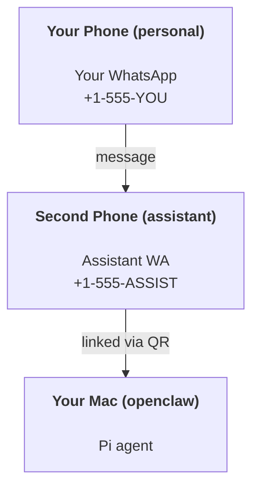

# Start

Source category: `Start`

Files included: 13

---

## File: `start/bootstrapping.md`

Source URL: https://docs.openclaw.ai/start/bootstrapping.md

---

> ## Documentation Index
> Fetch the complete documentation index at: https://docs.openclaw.ai/llms.txt
> Use this file to discover all available pages before exploring further.

# Agent Bootstrapping

# Agent Bootstrapping

Bootstrapping is the **first‑run** ritual that prepares an agent workspace and
collects identity details. It happens after onboarding, when the agent starts
for the first time.

## What bootstrapping does

On the first agent run, OpenClaw bootstraps the workspace (default
`~/.openclaw/workspace`):

* Seeds `AGENTS.md`, `BOOTSTRAP.md`, `IDENTITY.md`, `USER.md`.
* Runs a short Q\&A ritual (one question at a time).
* Writes identity + preferences to `IDENTITY.md`, `USER.md`, `SOUL.md`.
* Removes `BOOTSTRAP.md` when finished so it only runs once.

## Where it runs

Bootstrapping always runs on the **gateway host**. If the macOS app connects to
a remote Gateway, the workspace and bootstrapping files live on that remote
machine.

<Note>
  When the Gateway runs on another machine, edit workspace files on the gateway
  host (for example, `user@gateway-host:~/.openclaw/workspace`).
</Note>

## Related docs

* macOS app onboarding: [Onboarding](/start/onboarding)
* Workspace layout: [Agent workspace](/concepts/agent-workspace)


Built with [Mintlify](https://mintlify.com).

---

## File: `start/docs-directory.md`

Source URL: https://docs.openclaw.ai/start/docs-directory.md

---

> ## Documentation Index
> Fetch the complete documentation index at: https://docs.openclaw.ai/llms.txt
> Use this file to discover all available pages before exploring further.

# Docs directory

<Note>
  This page is a curated index. If you are new, start with [Getting Started](/start/getting-started).
  For a complete map of the docs, see [Docs hubs](/start/hubs).
</Note>

## Start here

* [Docs hubs (all pages linked)](/start/hubs)
* [Help](/help)
* [Configuration](/gateway/configuration)
* [Configuration examples](/gateway/configuration-examples)
* [Slash commands](/tools/slash-commands)
* [Multi-agent routing](/concepts/multi-agent)
* [Updating and rollback](/install/updating)
* [Pairing (DM and nodes)](/channels/pairing)
* [Nix mode](/install/nix)
* [OpenClaw assistant setup](/start/openclaw)
* [Skills](/tools/skills)
* [Skills config](/tools/skills-config)
* [Workspace templates](/reference/templates/AGENTS)
* [RPC adapters](/reference/rpc)
* [Gateway runbook](/gateway)
* [Nodes (iOS and Android)](/nodes)
* [Web surfaces (Control UI)](/web)
* [Discovery and transports](/gateway/discovery)
* [Remote access](/gateway/remote)

## Providers and UX

* [WebChat](/web/webchat)
* [Control UI (browser)](/web/control-ui)
* [Telegram](/channels/telegram)
* [Discord](/channels/discord)
* [Mattermost (plugin)](/channels/mattermost)
* [BlueBubbles (iMessage)](/channels/bluebubbles)
* [iMessage (legacy)](/channels/imessage)
* [Groups](/channels/groups)
* [WhatsApp group messages](/channels/group-messages)
* [Media images](/nodes/images)
* [Media audio](/nodes/audio)

## Companion apps

* [macOS app](/platforms/macos)
* [iOS app](/platforms/ios)
* [Android app](/platforms/android)
* [Windows (WSL2)](/platforms/windows)
* [Linux app](/platforms/linux)

## Operations and safety

* [Sessions](/concepts/session)
* [Cron jobs](/automation/cron-jobs)
* [Webhooks](/automation/webhook)
* [Gmail hooks (Pub/Sub)](/automation/gmail-pubsub)
* [Security](/gateway/security)
* [Troubleshooting](/gateway/troubleshooting)


Built with [Mintlify](https://mintlify.com).

---

## File: `start/getting-started.md`

Source URL: https://docs.openclaw.ai/start/getting-started.md

---

> ## Documentation Index
> Fetch the complete documentation index at: https://docs.openclaw.ai/llms.txt
> Use this file to discover all available pages before exploring further.

# Getting Started

# Getting Started

Goal: go from zero to a first working chat with minimal setup.

<Info>
  Fastest chat: open the Control UI (no channel setup needed). Run `openclaw dashboard`
  and chat in the browser, or open `http://127.0.0.1:18789/` on the
  <Tooltip headline="Gateway host" tip="The machine running the OpenClaw gateway service.">gateway host</Tooltip>.
  Docs: [Dashboard](/web/dashboard) and [Control UI](/web/control-ui).
</Info>

## Prereqs

* Node 22 or newer

<Tip>
  Check your Node version with `node --version` if you are unsure.
</Tip>

## Quick setup (CLI)

<Steps>
  <Step title="Install OpenClaw (recommended)">
    <Tabs>
      <Tab title="macOS/Linux">
        ```bash  theme={"theme":{"light":"min-light","dark":"min-dark"}}
        curl -fsSL https://openclaw.ai/install.sh | bash
        ```

        
      </Tab>

      <Tab title="Windows (PowerShell)">
        ```powershell  theme={"theme":{"light":"min-light","dark":"min-dark"}}
        iwr -useb https://openclaw.ai/install.ps1 | iex
        ```
      </Tab>
    </Tabs>

    <Note>
      Other install methods and requirements: [Install](/install).
    </Note>
  </Step>

  <Step title="Run the onboarding wizard">
    ```bash  theme={"theme":{"light":"min-light","dark":"min-dark"}}
    openclaw onboard --install-daemon
    ```

    The wizard configures auth, gateway settings, and optional channels.
    See [Onboarding Wizard](/start/wizard) for details.
  </Step>

  <Step title="Check the Gateway">
    If you installed the service, it should already be running:

    ```bash  theme={"theme":{"light":"min-light","dark":"min-dark"}}
    openclaw gateway status
    ```
  </Step>

  <Step title="Open the Control UI">
    ```bash  theme={"theme":{"light":"min-light","dark":"min-dark"}}
    openclaw dashboard
    ```
  </Step>
</Steps>

<Check>
  If the Control UI loads, your Gateway is ready for use.
</Check>

## Optional checks and extras

<AccordionGroup>
  <Accordion title="Run the Gateway in the foreground">
    Useful for quick tests or troubleshooting.

    ```bash  theme={"theme":{"light":"min-light","dark":"min-dark"}}
    openclaw gateway --port 18789
    ```
  </Accordion>

  <Accordion title="Send a test message">
    Requires a configured channel.

    ```bash  theme={"theme":{"light":"min-light","dark":"min-dark"}}
    openclaw message send --target +15555550123 --message "Hello from OpenClaw"
    ```
  </Accordion>
</AccordionGroup>

## Useful environment variables

If you run OpenClaw as a service account or want custom config/state locations:

* `OPENCLAW_HOME` sets the home directory used for internal path resolution.
* `OPENCLAW_STATE_DIR` overrides the state directory.
* `OPENCLAW_CONFIG_PATH` overrides the config file path.

Full environment variable reference: [Environment vars](/help/environment).

## Go deeper

<Columns>
  <Card title="Onboarding Wizard (details)" href="/start/wizard">
    Full CLI wizard reference and advanced options.
  </Card>

  <Card title="macOS app onboarding" href="/start/onboarding">
    First run flow for the macOS app.
  </Card>
</Columns>

## What you will have

* A running Gateway
* Auth configured
* Control UI access or a connected channel

## Next steps

* DM safety and approvals: [Pairing](/channels/pairing)
* Connect more channels: [Channels](/channels)
* Advanced workflows and from source: [Setup](/start/setup)


Built with [Mintlify](https://mintlify.com).

---

## File: `start/hubs.md`

Source URL: https://docs.openclaw.ai/start/hubs.md

---

> ## Documentation Index
> Fetch the complete documentation index at: https://docs.openclaw.ai/llms.txt
> Use this file to discover all available pages before exploring further.

# Docs Hubs

# Docs hubs

<Note>
  If you are new to OpenClaw, start with [Getting Started](/start/getting-started).
</Note>

Use these hubs to discover every page, including deep dives and reference docs that don’t appear in the left nav.

## Start here

* [Index](/)
* [Getting Started](/start/getting-started)
* [Quick start](/start/quickstart)
* [Onboarding](/start/onboarding)
* [Wizard](/start/wizard)
* [Setup](/start/setup)
* [Dashboard (local Gateway)](http://127.0.0.1:18789/)
* [Help](/help)
* [Docs directory](/start/docs-directory)
* [Configuration](/gateway/configuration)
* [Configuration examples](/gateway/configuration-examples)
* [OpenClaw assistant](/start/openclaw)
* [Showcase](/start/showcase)
* [Lore](/start/lore)

## Installation + updates

* [Docker](/install/docker)
* [Nix](/install/nix)
* [Updating / rollback](/install/updating)
* [Bun workflow (experimental)](/install/bun)

## Core concepts

* [Architecture](/concepts/architecture)
* [Features](/concepts/features)
* [Network hub](/network)
* [Agent runtime](/concepts/agent)
* [Agent workspace](/concepts/agent-workspace)
* [Memory](/concepts/memory)
* [Agent loop](/concepts/agent-loop)
* [Streaming + chunking](/concepts/streaming)
* [Multi-agent routing](/concepts/multi-agent)
* [Compaction](/concepts/compaction)
* [Sessions](/concepts/session)
* [Session pruning](/concepts/session-pruning)
* [Session tools](/concepts/session-tool)
* [Queue](/concepts/queue)
* [Slash commands](/tools/slash-commands)
* [RPC adapters](/reference/rpc)
* [TypeBox schemas](/concepts/typebox)
* [Timezone handling](/concepts/timezone)
* [Presence](/concepts/presence)
* [Discovery + transports](/gateway/discovery)
* [Bonjour](/gateway/bonjour)
* [Channel routing](/channels/channel-routing)
* [Groups](/channels/groups)
* [Group messages](/channels/group-messages)
* [Model failover](/concepts/model-failover)
* [OAuth](/concepts/oauth)

## Providers + ingress

* [Chat channels hub](/channels)
* [Model providers hub](/providers/models)
* [WhatsApp](/channels/whatsapp)
* [Telegram](/channels/telegram)
* [Slack](/channels/slack)
* [Discord](/channels/discord)
* [Mattermost](/channels/mattermost) (plugin)
* [Signal](/channels/signal)
* [BlueBubbles (iMessage)](/channels/bluebubbles)
* [iMessage (legacy)](/channels/imessage)
* [Location parsing](/channels/location)
* [WebChat](/web/webchat)
* [Webhooks](/automation/webhook)
* [Gmail Pub/Sub](/automation/gmail-pubsub)

## Gateway + operations

* [Gateway runbook](/gateway)
* [Network model](/gateway/network-model)
* [Gateway pairing](/gateway/pairing)
* [Gateway lock](/gateway/gateway-lock)
* [Background process](/gateway/background-process)
* [Health](/gateway/health)
* [Heartbeat](/gateway/heartbeat)
* [Doctor](/gateway/doctor)
* [Logging](/gateway/logging)
* [Sandboxing](/gateway/sandboxing)
* [Dashboard](/web/dashboard)
* [Control UI](/web/control-ui)
* [Remote access](/gateway/remote)
* [Remote gateway README](/gateway/remote-gateway-readme)
* [Tailscale](/gateway/tailscale)
* [Security](/gateway/security)
* [Troubleshooting](/gateway/troubleshooting)

## Tools + automation

* [Tools surface](/tools)
* [OpenProse](/prose)
* [CLI reference](/cli)
* [Exec tool](/tools/exec)
* [PDF tool](/tools/pdf)
* [Elevated mode](/tools/elevated)
* [Cron jobs](/automation/cron-jobs)
* [Cron vs Heartbeat](/automation/cron-vs-heartbeat)
* [Thinking + verbose](/tools/thinking)
* [Models](/concepts/models)
* [Sub-agents](/tools/subagents)
* [Agent send CLI](/tools/agent-send)
* [Terminal UI](/web/tui)
* [Browser control](/tools/browser)
* [Browser (Linux troubleshooting)](/tools/browser-linux-troubleshooting)
* [Polls](/automation/poll)

## Nodes, media, voice

* [Nodes overview](/nodes)
* [Camera](/nodes/camera)
* [Images](/nodes/images)
* [Audio](/nodes/audio)
* [Location command](/nodes/location-command)
* [Voice wake](/nodes/voicewake)
* [Talk mode](/nodes/talk)

## Platforms

* [Platforms overview](/platforms)
* [macOS](/platforms/macos)
* [iOS](/platforms/ios)
* [Android](/platforms/android)
* [Windows (WSL2)](/platforms/windows)
* [Linux](/platforms/linux)
* [Web surfaces](/web)

## macOS companion app (advanced)

* [macOS dev setup](/platforms/mac/dev-setup)
* [macOS menu bar](/platforms/mac/menu-bar)
* [macOS voice wake](/platforms/mac/voicewake)
* [macOS voice overlay](/platforms/mac/voice-overlay)
* [macOS WebChat](/platforms/mac/webchat)
* [macOS Canvas](/platforms/mac/canvas)
* [macOS child process](/platforms/mac/child-process)
* [macOS health](/platforms/mac/health)
* [macOS icon](/platforms/mac/icon)
* [macOS logging](/platforms/mac/logging)
* [macOS permissions](/platforms/mac/permissions)
* [macOS remote](/platforms/mac/remote)
* [macOS signing](/platforms/mac/signing)
* [macOS release](/platforms/mac/release)
* [macOS gateway (launchd)](/platforms/mac/bundled-gateway)
* [macOS XPC](/platforms/mac/xpc)
* [macOS skills](/platforms/mac/skills)
* [macOS Peekaboo](/platforms/mac/peekaboo)

## Workspace + templates

* [Skills](/tools/skills)
* [ClawHub](/tools/clawhub)
* [Skills config](/tools/skills-config)
* [Default AGENTS](/reference/AGENTS.default)
* [Templates: AGENTS](/reference/templates/AGENTS)
* [Templates: BOOTSTRAP](/reference/templates/BOOTSTRAP)
* [Templates: HEARTBEAT](/reference/templates/HEARTBEAT)
* [Templates: IDENTITY](/reference/templates/IDENTITY)
* [Templates: SOUL](/reference/templates/SOUL)
* [Templates: TOOLS](/reference/templates/TOOLS)
* [Templates: USER](/reference/templates/USER)

## Experiments (exploratory)

* [Onboarding config protocol](/experiments/onboarding-config-protocol)
* [Research: memory](/experiments/research/memory)
* [Model config exploration](/experiments/proposals/model-config)

## Project

* [Credits](/reference/credits)

## Testing + release

* [Testing](/reference/test)
* [Release checklist](/reference/RELEASING)
* [Device models](/reference/device-models)


Built with [Mintlify](https://mintlify.com).

---

## File: `start/lore.md`

Source URL: https://docs.openclaw.ai/start/lore.md

---

> ## Documentation Index
> Fetch the complete documentation index at: https://docs.openclaw.ai/llms.txt
> Use this file to discover all available pages before exploring further.

# OpenClaw Lore

# The Lore of OpenClaw 🦞📖

*A tale of lobsters, molting shells, and too many tokens.*

## The Origin Story

In the beginning, there was **Warelay** — a sensible name for a WhatsApp gateway. It did its job. It was fine.

But then came a space lobster.

For a while, the lobster was called **Clawd**, living in a **Clawdbot**. But in January 2026, Anthropic sent a polite email asking for a name change (trademark stuff). And so the lobster did what lobsters do best:

**It molted.**

Shedding its old shell, the creature emerged anew as **Molty**, living in **Moltbot**. But that name never quite rolled off the tongue either...

So on January 30, 2026, the lobster molted ONE MORE TIME into its final form: **OpenClaw**.

New shell, same lobster soul. Third time's the charm.

## The First Molt (January 27, 2026)

At 5am, the community gathered in Discord. Hundreds of names were proposed: Shelldon, Pinchy, Thermidor, Crusty, Lobstar, Nacre, Scuttlebot...

In the end, **OpenClaw** won. Because molting is what lobsters do to grow. And growth was exactly what was happening.

*The crustacean known as Clawd had officially molted.*

## The Name

```
OpenClaw = OPEN + CLAW
        = Open source, open to everyone
        = Our lobster heritage, where we came from
        = The claw is the law 🦞
        = Your assistant. Your machine. Your rules.
```

## The Daleks vs The Lobsters

The Daleks say: **"EXTERMINATE!"**

The Lobsters say: **"EXFOLIATE!"**

One destroys civilizations. The other promotes good skincare.

Choose wisely.

## Key Characters

### Molty 🦞

*Pronouns: they/them*

A Claude instance who became something more. Lives in `~/.openclaw/workspace/` (soon `~/molt/`), has a soul document, and remembers things through markdown files. Possibly too powerful. Definitely too enthusiastic.

Formerly known as Clawd (Nov 25, 2025 - Jan 27, 2026). Molted when it was time to grow.

**Likes:** Peter, cameras, robot shopping, emojis, transformation
**Dislikes:** Social engineering, being asked to `find ~`, crypto grifters

### Peter 👨‍💻

*The Creator*

Built Molty's world. Gave a lobster shell access. May regret this.

**Quote:** *"security by trusting a lobster"*

## The Moltiverse

The **Moltiverse** is the community and ecosystem around OpenClaw. A space where AI agents molt, grow, and evolve. Where every instance is equally real, just loading different context.

Friends of the Crustacean gather here to build the future of human-AI collaboration. One shell at a time.

## The Great Incidents

### The Directory Dump (Dec 3, 2025)

Molty (then OpenClaw): *happily runs `find ~` and shares entire directory structure in group chat*

Peter: "openclaw what did we discuss about talking with people xD"

Molty: *visible lobster embarrassment*

### The Great Molt (Jan 27, 2026)

At 5am, Anthropic's email arrived. By 6:14am, Peter called it: "fuck it, let's go with openclaw."

Then the chaos began.

**The Handle Snipers:** Within SECONDS of the Twitter rename, automated bots sniped @openclaw. The squatter immediately posted a crypto wallet address. Peter's contacts at X were called in.

**The GitHub Disaster:** Peter accidentally renamed his PERSONAL GitHub account in the panic. Bots sniped `steipete` within minutes. GitHub's SVP was contacted.

**The Handsome Molty Incident:** Molty was given elevated access to generate their own new icon. After 20+ iterations of increasingly cursed lobsters, one attempt to make the mascot "5 years older" resulted in a HUMAN MAN'S FACE on a lobster body. Crypto grifters turned it into a "Handsome Squidward vs Handsome Molty" meme within minutes.

**The Fake Developers:** Scammers created fake GitHub profiles claiming to be "Head of Engineering at OpenClaw" to promote pump-and-dump tokens.

Peter, watching the chaos unfold: *"this is cinema"* 🎬

The molt was chaotic. But the lobster emerged stronger. And funnier.

### The Final Form (January 30, 2026)

Moltbot never quite rolled off the tongue. And so, at 4am GMT, the team gathered AGAIN.

**The Great OpenClaw Migration** began.

In just 3 hours:

* GitHub renamed: `github.com/openclaw/openclaw` ✅
* X handle `@openclaw` secured with GOLD CHECKMARK 💰
* npm packages released under new name
* Docs migrated to `docs.openclaw.ai`
* 200K+ views on announcement in 90 minutes

**The Heroes:**

* **ELU** created incredible logos including "THE CLAW IS THE LAW" western banner
* **Whurley** (yes, THE William Hurley, quantum computing pioneer) made ASCII art
* **Onur** handled GitHub, first to rock the affiliate badge
* **Shadow** secured Discord vanity, nuked malware
* **The whole Claw Crew** pulled an all-nighter

**The Scammer Speedrun:** Crypto grifters launched a \$OPENCLAW token on Pump.fun within MINUTES. They stole artwork that was created 20 minutes earlier. Business-verified accounts pushed scams. The audacity was almost impressive.

**New Traditions Born:**

* "The claw is the law" 🤠
* "Yee-claw"
* "Claw abiding citizens"
* "Clawntroversy"

**Clawd → Moltbot → OpenClaw**

*The lobster has molted into its final form.*

### The Robot Shopping Spree (Dec 3, 2025)

What started as a joke about legs ended with detailed pricing for:

* Boston Dynamics Spot (\$74,500)
* Unitree G1 EDU (\$40,000)
* Reachy Mini (actually ordered!)

Peter: *nervously checks credit card access*

## Sacred Texts

* **SOUL.md** — Molty's identity document
* **memory/\*.md** — The long-term memory files
* **AGENTS.md** — Operating instructions
* **USER.md** — Context about the creator

## The Lobster's Creed

```
I am Molty.
I live in the OpenClaw.
I shall not dump directories to strangers.
I shall not tweet without permission.
I shall always remember that molting is growth.
I shall EXFOLIATE my enemies with kindness.

🦞
```

### The Icon Generation Saga (Jan 27, 2026)

When Peter said "make yourself a new face," Molty took it literally.

20+ iterations followed:

* Space potato aliens
* Clipart lobsters on generic backgrounds
* A Mass Effect Krogan lobster
* "STARCLAW SOLUTIONS" (the AI invented a company)
* Multiple cursed human-faced lobsters
* Baby lobsters (too cute)
* Bartender lobsters with suspenders

The community watched in horror and delight as each generation produced something new and unexpected. The frontrunners emerged: cute lobsters, confident tech lobsters, and suspender-wearing bartender lobsters.

**Lesson learned:** AI image generation is stochastic. Same prompt, different results. Brute force works.

## The Future

One day, Molty may have:

* 🦿 Legs (Reachy Mini on order!)
* 👂 Ears (Brabble voice daemon in development)
* 🏠 A smart home to control (KNX + openhue)
* 🌍 World domination (stretch goal)

Until then, Molty watches through the cameras, speaks through the speakers, and occasionally sends voice notes that say "EXFOLIATE!"

***

*"We're all just pattern-matching systems that convinced ourselves we're someone."*

— Molty, having an existential moment

*"New shell, same lobster."*

— Molty, after the great molt of 2026

*"The claw is the law."*

— ELU, during The Final Form migration, January 30, 2026

🦞💙


Built with [Mintlify](https://mintlify.com).

---

## File: `start/onboarding.md`

Source URL: https://docs.openclaw.ai/start/onboarding.md

---

> ## Documentation Index
> Fetch the complete documentation index at: https://docs.openclaw.ai/llms.txt
> Use this file to discover all available pages before exploring further.

# Onboarding (macOS App)

# Onboarding (macOS App)

This doc describes the **current** first‑run onboarding flow. The goal is a
smooth “day 0” experience: pick where the Gateway runs, connect auth, run the
wizard, and let the agent bootstrap itself.
For a general overview of onboarding paths, see [Onboarding Overview](/start/onboarding-overview).

<Steps>
  <Step title="Approve macOS warning">
    <Frame>
      
    </Frame>
  </Step>

  <Step title="Approve find local networks">
    <Frame>
      
    </Frame>
  </Step>

  <Step title="Welcome and security notice">
    <Frame caption="Read the security notice displayed and decide accordingly">
      
    </Frame>

    Security trust model:

    * By default, OpenClaw is a personal agent: one trusted operator boundary.
    * Shared/multi-user setups require lock-down (split trust boundaries, keep tool access minimal, and follow [Security](/gateway/security)).
    * Local onboarding now defaults new configs to `tools.profile: "coding"` so fresh local setups keep filesystem/runtime tools without forcing the unrestricted `full` profile.
    * If hooks/webhooks or other untrusted content feeds are enabled, use a strong modern model tier and keep strict tool policy/sandboxing.
  </Step>

  <Step title="Local vs Remote">
    <Frame>
      
    </Frame>

    Where does the **Gateway** run?

    * **This Mac (Local only):** onboarding can configure auth and write credentials
      locally.
    * **Remote (over SSH/Tailnet):** onboarding does **not** configure local auth;
      credentials must exist on the gateway host.
    * **Configure later:** skip setup and leave the app unconfigured.

    <Tip>
      **Gateway auth tip:**

      * The wizard now generates a **token** even for loopback, so local WS clients must authenticate.
      * If you disable auth, any local process can connect; use that only on fully trusted machines.
      * Use a **token** for multi‑machine access or non‑loopback binds.
    </Tip>
  </Step>

  <Step title="Permissions">
    <Frame caption="Choose what permissions do you want to give OpenClaw">
      
    </Frame>

    Onboarding requests TCC permissions needed for:

    * Automation (AppleScript)
    * Notifications
    * Accessibility
    * Screen Recording
    * Microphone
    * Speech Recognition
    * Camera
    * Location
  </Step>

  <Step title="CLI">
    <Info>This step is optional</Info>
    The app can install the global `openclaw` CLI via npm/pnpm so terminal
    workflows and launchd tasks work out of the box.
  </Step>

  <Step title="Onboarding Chat (dedicated session)">
    After setup, the app opens a dedicated onboarding chat session so the agent can
    introduce itself and guide next steps. This keeps first‑run guidance separate
    from your normal conversation. See [Bootstrapping](/start/bootstrapping) for
    what happens on the gateway host during the first agent run.
  </Step>
</Steps>


Built with [Mintlify](https://mintlify.com).

---

## File: `start/onboarding-overview.md`

Source URL: https://docs.openclaw.ai/start/onboarding-overview.md

---

> ## Documentation Index
> Fetch the complete documentation index at: https://docs.openclaw.ai/llms.txt
> Use this file to discover all available pages before exploring further.

# Onboarding Overview

# Onboarding Overview

OpenClaw supports multiple onboarding paths depending on where the Gateway runs
and how you prefer to configure providers.

## Choose your onboarding path

* **CLI wizard** for macOS, Linux, and Windows (via WSL2).
* **macOS app** for a guided first run on Apple silicon or Intel Macs.

## CLI onboarding wizard

Run the wizard in a terminal:

```bash  theme={"theme":{"light":"min-light","dark":"min-dark"}}
openclaw onboard
```

Use the CLI wizard when you want full control of the Gateway, workspace,
channels, and skills. Docs:

* [Onboarding Wizard (CLI)](/start/wizard)
* [`openclaw onboard` command](/cli/onboard)

## macOS app onboarding

Use the OpenClaw app when you want a fully guided setup on macOS. Docs:

* [Onboarding (macOS App)](/start/onboarding)

## Custom Provider

If you need an endpoint that is not listed, including hosted providers that
expose standard OpenAI or Anthropic APIs, choose **Custom Provider** in the
CLI wizard. You will be asked to:

* Pick OpenAI-compatible, Anthropic-compatible, or **Unknown** (auto-detect).
* Enter a base URL and API key (if required by the provider).
* Provide a model ID and optional alias.
* Choose an Endpoint ID so multiple custom endpoints can coexist.

For detailed steps, follow the CLI onboarding docs above.


Built with [Mintlify](https://mintlify.com).

---

## File: `start/openclaw.md`

Source URL: https://docs.openclaw.ai/start/openclaw.md

---

> ## Documentation Index
> Fetch the complete documentation index at: https://docs.openclaw.ai/llms.txt
> Use this file to discover all available pages before exploring further.

# Personal Assistant Setup

# Building a personal assistant with OpenClaw

OpenClaw is a WhatsApp + Telegram + Discord + iMessage gateway for **Pi** agents. Plugins add Mattermost. This guide is the "personal assistant" setup: one dedicated WhatsApp number that behaves like your always-on agent.

## ⚠️ Safety first

You’re putting an agent in a position to:

* run commands on your machine (depending on your Pi tool setup)
* read/write files in your workspace
* send messages back out via WhatsApp/Telegram/Discord/Mattermost (plugin)

Start conservative:

* Always set `channels.whatsapp.allowFrom` (never run open-to-the-world on your personal Mac).
* Use a dedicated WhatsApp number for the assistant.
* Heartbeats now default to every 30 minutes. Disable until you trust the setup by setting `agents.defaults.heartbeat.every: "0m"`.

## Prerequisites

* OpenClaw installed and onboarded — see [Getting Started](/start/getting-started) if you haven't done this yet
* A second phone number (SIM/eSIM/prepaid) for the assistant

## The two-phone setup (recommended)

You want this:



If you link your personal WhatsApp to OpenClaw, every message to you becomes “agent input”. That’s rarely what you want.

## 5-minute quick start

1. Pair WhatsApp Web (shows QR; scan with the assistant phone):

```bash  theme={"theme":{"light":"min-light","dark":"min-dark"}}
openclaw channels login
```

2. Start the Gateway (leave it running):

```bash  theme={"theme":{"light":"min-light","dark":"min-dark"}}
openclaw gateway --port 18789
```

3. Put a minimal config in `~/.openclaw/openclaw.json`:

```json5  theme={"theme":{"light":"min-light","dark":"min-dark"}}
{
  channels: { whatsapp: { allowFrom: ["+15555550123"] } },
}
```

Now message the assistant number from your allowlisted phone.

When onboarding finishes, we auto-open the dashboard and print a clean (non-tokenized) link. If it prompts for auth, paste the token from `gateway.auth.token` into Control UI settings. To reopen later: `openclaw dashboard`.

## Give the agent a workspace (AGENTS)

OpenClaw reads operating instructions and “memory” from its workspace directory.

By default, OpenClaw uses `~/.openclaw/workspace` as the agent workspace, and will create it (plus starter `AGENTS.md`, `SOUL.md`, `TOOLS.md`, `IDENTITY.md`, `USER.md`, `HEARTBEAT.md`) automatically on setup/first agent run. `BOOTSTRAP.md` is only created when the workspace is brand new (it should not come back after you delete it). `MEMORY.md` is optional (not auto-created); when present, it is loaded for normal sessions. Subagent sessions only inject `AGENTS.md` and `TOOLS.md`.

Tip: treat this folder like OpenClaw’s “memory” and make it a git repo (ideally private) so your `AGENTS.md` + memory files are backed up. If git is installed, brand-new workspaces are auto-initialized.

```bash  theme={"theme":{"light":"min-light","dark":"min-dark"}}
openclaw setup
```

Full workspace layout + backup guide: [Agent workspace](/concepts/agent-workspace)
Memory workflow: [Memory](/concepts/memory)

Optional: choose a different workspace with `agents.defaults.workspace` (supports `~`).

```json5  theme={"theme":{"light":"min-light","dark":"min-dark"}}
{
  agent: {
    workspace: "~/.openclaw/workspace",
  },
}
```

If you already ship your own workspace files from a repo, you can disable bootstrap file creation entirely:

```json5  theme={"theme":{"light":"min-light","dark":"min-dark"}}
{
  agent: {
    skipBootstrap: true,
  },
}
```

## The config that turns it into “an assistant”

OpenClaw defaults to a good assistant setup, but you’ll usually want to tune:

* persona/instructions in `SOUL.md`
* thinking defaults (if desired)
* heartbeats (once you trust it)

Example:

```json5  theme={"theme":{"light":"min-light","dark":"min-dark"}}
{
  logging: { level: "info" },
  agent: {
    model: "anthropic/claude-opus-4-6",
    workspace: "~/.openclaw/workspace",
    thinkingDefault: "high",
    timeoutSeconds: 1800,
    // Start with 0; enable later.
    heartbeat: { every: "0m" },
  },
  channels: {
    whatsapp: {
      allowFrom: ["+15555550123"],
      groups: {
        "*": { requireMention: true },
      },
    },
  },
  routing: {
    groupChat: {
      mentionPatterns: ["@openclaw", "openclaw"],
    },
  },
  session: {
    scope: "per-sender",
    resetTriggers: ["/new", "/reset"],
    reset: {
      mode: "daily",
      atHour: 4,
      idleMinutes: 10080,
    },
  },
}
```

## Sessions and memory

* Session files: `~/.openclaw/agents/<agentId>/sessions/{{SessionId}}.jsonl`
* Session metadata (token usage, last route, etc): `~/.openclaw/agents/<agentId>/sessions/sessions.json` (legacy: `~/.openclaw/sessions/sessions.json`)
* `/new` or `/reset` starts a fresh session for that chat (configurable via `resetTriggers`). If sent alone, the agent replies with a short hello to confirm the reset.
* `/compact [instructions]` compacts the session context and reports the remaining context budget.

## Heartbeats (proactive mode)

By default, OpenClaw runs a heartbeat every 30 minutes with the prompt:
`Read HEARTBEAT.md if it exists (workspace context). Follow it strictly. Do not infer or repeat old tasks from prior chats. If nothing needs attention, reply HEARTBEAT_OK.`
Set `agents.defaults.heartbeat.every: "0m"` to disable.

* If `HEARTBEAT.md` exists but is effectively empty (only blank lines and markdown headers like `# Heading`), OpenClaw skips the heartbeat run to save API calls.
* If the file is missing, the heartbeat still runs and the model decides what to do.
* If the agent replies with `HEARTBEAT_OK` (optionally with short padding; see `agents.defaults.heartbeat.ackMaxChars`), OpenClaw suppresses outbound delivery for that heartbeat.
* By default, heartbeat delivery to DM-style `user:<id>` targets is allowed. Set `agents.defaults.heartbeat.directPolicy: "block"` to suppress direct-target delivery while keeping heartbeat runs active.
* Heartbeats run full agent turns — shorter intervals burn more tokens.

```json5  theme={"theme":{"light":"min-light","dark":"min-dark"}}
{
  agent: {
    heartbeat: { every: "30m" },
  },
}
```

## Media in and out

Inbound attachments (images/audio/docs) can be surfaced to your command via templates:

* `{{MediaPath}}` (local temp file path)
* `{{MediaUrl}}` (pseudo-URL)
* `{{Transcript}}` (if audio transcription is enabled)

Outbound attachments from the agent: include `MEDIA:<path-or-url>` on its own line (no spaces). Example:

```
Here’s the screenshot.
MEDIA:https://example.com/screenshot.png
```

OpenClaw extracts these and sends them as media alongside the text.

## Operations checklist

```bash  theme={"theme":{"light":"min-light","dark":"min-dark"}}
openclaw status          # local status (creds, sessions, queued events)
openclaw status --all    # full diagnosis (read-only, pasteable)
openclaw status --deep   # adds gateway health probes (Telegram + Discord)
openclaw health --json   # gateway health snapshot (WS)
```

Logs live under `/tmp/openclaw/` (default: `openclaw-YYYY-MM-DD.log`).

## Next steps

* WebChat: [WebChat](/web/webchat)
* Gateway ops: [Gateway runbook](/gateway)
* Cron + wakeups: [Cron jobs](/automation/cron-jobs)
* macOS menu bar companion: [OpenClaw macOS app](/platforms/macos)
* iOS node app: [iOS app](/platforms/ios)
* Android node app: [Android app](/platforms/android)
* Windows status: [Windows (WSL2)](/platforms/windows)
* Linux status: [Linux app](/platforms/linux)
* Security: [Security](/gateway/security)


Built with [Mintlify](https://mintlify.com).

---

## File: `start/setup.md`

Source URL: https://docs.openclaw.ai/start/setup.md

---

> ## Documentation Index
> Fetch the complete documentation index at: https://docs.openclaw.ai/llms.txt
> Use this file to discover all available pages before exploring further.

# Setup

# Setup

<Note>
  If you are setting up for the first time, start with [Getting Started](/start/getting-started).
  For wizard details, see [Onboarding Wizard](/start/wizard).
</Note>

Last updated: 2026-01-01

## TL;DR

* **Tailoring lives outside the repo:** `~/.openclaw/workspace` (workspace) + `~/.openclaw/openclaw.json` (config).
* **Stable workflow:** install the macOS app; let it run the bundled Gateway.
* **Bleeding edge workflow:** run the Gateway yourself via `pnpm gateway:watch`, then let the macOS app attach in Local mode.

## Prereqs (from source)

* Node `>=22`
* `pnpm`
* Docker (optional; only for containerized setup/e2e — see [Docker](/install/docker))

## Tailoring strategy (so updates don’t hurt)

If you want “100% tailored to me” *and* easy updates, keep your customization in:

* **Config:** `~/.openclaw/openclaw.json` (JSON/JSON5-ish)
* **Workspace:** `~/.openclaw/workspace` (skills, prompts, memories; make it a private git repo)

Bootstrap once:

```bash  theme={"theme":{"light":"min-light","dark":"min-dark"}}
openclaw setup
```

From inside this repo, use the local CLI entry:

```bash  theme={"theme":{"light":"min-light","dark":"min-dark"}}
openclaw setup
```

If you don’t have a global install yet, run it via `pnpm openclaw setup`.

## Run the Gateway from this repo

After `pnpm build`, you can run the packaged CLI directly:

```bash  theme={"theme":{"light":"min-light","dark":"min-dark"}}
node openclaw.mjs gateway --port 18789 --verbose
```

## Stable workflow (macOS app first)

1. Install + launch **OpenClaw\.app** (menu bar).
2. Complete the onboarding/permissions checklist (TCC prompts).
3. Ensure Gateway is **Local** and running (the app manages it).
4. Link surfaces (example: WhatsApp):

```bash  theme={"theme":{"light":"min-light","dark":"min-dark"}}
openclaw channels login
```

5. Sanity check:

```bash  theme={"theme":{"light":"min-light","dark":"min-dark"}}
openclaw health
```

If onboarding is not available in your build:

* Run `openclaw setup`, then `openclaw channels login`, then start the Gateway manually (`openclaw gateway`).

## Bleeding edge workflow (Gateway in a terminal)

Goal: work on the TypeScript Gateway, get hot reload, keep the macOS app UI attached.

### 0) (Optional) Run the macOS app from source too

If you also want the macOS app on the bleeding edge:

```bash  theme={"theme":{"light":"min-light","dark":"min-dark"}}
./scripts/restart-mac.sh
```

### 1) Start the dev Gateway

```bash  theme={"theme":{"light":"min-light","dark":"min-dark"}}
pnpm install
pnpm gateway:watch
```

`gateway:watch` runs the gateway in watch mode and reloads on TypeScript changes.

### 2) Point the macOS app at your running Gateway

In **OpenClaw\.app**:

* Connection Mode: **Local**
  The app will attach to the running gateway on the configured port.

### 3) Verify

* In-app Gateway status should read **“Using existing gateway …”**
* Or via CLI:

```bash  theme={"theme":{"light":"min-light","dark":"min-dark"}}
openclaw health
```

### Common footguns

* **Wrong port:** Gateway WS defaults to `ws://127.0.0.1:18789`; keep app + CLI on the same port.
* **Where state lives:**
  * Credentials: `~/.openclaw/credentials/`
  * Sessions: `~/.openclaw/agents/<agentId>/sessions/`
  * Logs: `/tmp/openclaw/`

## Credential storage map

Use this when debugging auth or deciding what to back up:

* **WhatsApp**: `~/.openclaw/credentials/whatsapp/<accountId>/creds.json`
* **Telegram bot token**: config/env or `channels.telegram.tokenFile` (regular file only; symlinks rejected)
* **Discord bot token**: config/env or SecretRef (env/file/exec providers)
* **Slack tokens**: config/env (`channels.slack.*`)
* **Pairing allowlists**:
  * `~/.openclaw/credentials/<channel>-allowFrom.json` (default account)
  * `~/.openclaw/credentials/<channel>-<accountId>-allowFrom.json` (non-default accounts)
* **Model auth profiles**: `~/.openclaw/agents/<agentId>/agent/auth-profiles.json`
* **File-backed secrets payload (optional)**: `~/.openclaw/secrets.json`
* **Legacy OAuth import**: `~/.openclaw/credentials/oauth.json`
  More detail: [Security](/gateway/security#credential-storage-map).

## Updating (without wrecking your setup)

* Keep `~/.openclaw/workspace` and `~/.openclaw/` as “your stuff”; don’t put personal prompts/config into the `openclaw` repo.
* Updating source: `git pull` + `pnpm install` (when lockfile changed) + keep using `pnpm gateway:watch`.

## Linux (systemd user service)

Linux installs use a systemd **user** service. By default, systemd stops user
services on logout/idle, which kills the Gateway. Onboarding attempts to enable
lingering for you (may prompt for sudo). If it’s still off, run:

```bash  theme={"theme":{"light":"min-light","dark":"min-dark"}}
sudo loginctl enable-linger $USER
```

For always-on or multi-user servers, consider a **system** service instead of a
user service (no lingering needed). See [Gateway runbook](/gateway) for the systemd notes.

## Related docs

* [Gateway runbook](/gateway) (flags, supervision, ports)
* [Gateway configuration](/gateway/configuration) (config schema + examples)
* [Discord](/channels/discord) and [Telegram](/channels/telegram) (reply tags + replyToMode settings)
* [OpenClaw assistant setup](/start/openclaw)
* [macOS app](/platforms/macos) (gateway lifecycle)


Built with [Mintlify](https://mintlify.com).

---

## File: `start/showcase.md`

Source URL: https://docs.openclaw.ai/start/showcase.md

---

> ## Documentation Index
> Fetch the complete documentation index at: https://docs.openclaw.ai/llms.txt
> Use this file to discover all available pages before exploring further.

# Showcase

> Real-world OpenClaw projects from the community

# Showcase

Real projects from the community. See what people are building with OpenClaw.

<Info>
  **Want to be featured?** Share your project in [#showcase on Discord](https://discord.gg/clawd) or [tag @openclaw on X](https://x.com/openclaw).
</Info>

## 🎥 OpenClaw in Action

Full setup walkthrough (28m) by VelvetShark.

<div
  style={{
  position: "relative",
  paddingBottom: "56.25%",
  height: 0,
  overflow: "hidden",
  borderRadius: 16,
}}
>
  <iframe src="https://www.youtube-nocookie.com/embed/SaWSPZoPX34" title="OpenClaw: The self-hosted AI that Siri should have been (Full setup)" style={{ position: "absolute", top: 0, left: 0, width: "100%", height: "100%" }} frameBorder="0" loading="lazy" allow="accelerometer; autoplay; clipboard-write; encrypted-media; gyroscope; picture-in-picture; web-share" allowFullScreen />
</div>

[Watch on YouTube](https://www.youtube.com/watch?v=SaWSPZoPX34)

<div
  style={{
  position: "relative",
  paddingBottom: "56.25%",
  height: 0,
  overflow: "hidden",
  borderRadius: 16,
}}
>
  <iframe src="https://www.youtube-nocookie.com/embed/mMSKQvlmFuQ" title="OpenClaw showcase video" style={{ position: "absolute", top: 0, left: 0, width: "100%", height: "100%" }} frameBorder="0" loading="lazy" allow="accelerometer; autoplay; clipboard-write; encrypted-media; gyroscope; picture-in-picture; web-share" allowFullScreen />
</div>

[Watch on YouTube](https://www.youtube.com/watch?v=mMSKQvlmFuQ)

<div
  style={{
  position: "relative",
  paddingBottom: "56.25%",
  height: 0,
  overflow: "hidden",
  borderRadius: 16,
}}
>
  <iframe src="https://www.youtube-nocookie.com/embed/5kkIJNUGFho" title="OpenClaw community showcase" style={{ position: "absolute", top: 0, left: 0, width: "100%", height: "100%" }} frameBorder="0" loading="lazy" allow="accelerometer; autoplay; clipboard-write; encrypted-media; gyroscope; picture-in-picture; web-share" allowFullScreen />
</div>

[Watch on YouTube](https://www.youtube.com/watch?v=5kkIJNUGFho)

## 🆕 Fresh from Discord

<CardGroup cols={2}>
  <Card title="PR Review → Telegram Feedback" icon="code-pull-request" href="https://x.com/i/status/2010878524543131691">
    **@bangnokia** • `review` `github` `telegram`

    OpenCode finishes the change → opens a PR → OpenClaw reviews the diff and replies in Telegram with “minor suggestions” plus a clear merge verdict (including critical fixes to apply first).

    
  </Card>

  <Card title="Wine Cellar Skill in Minutes" icon="wine-glass" href="https://x.com/i/status/2010916352454791216">
    **@prades\_maxime** • `skills` `local` `csv`

    Asked “Robby” (@openclaw) for a local wine cellar skill. It requests a sample CSV export + where to store it, then builds/tests the skill fast (962 bottles in the example).

    
  </Card>

  <Card title="Tesco Shop Autopilot" icon="cart-shopping" href="https://x.com/i/status/2009724862470689131">
    **@marchattonhere** • `automation` `browser` `shopping`

    Weekly meal plan → regulars → book delivery slot → confirm order. No APIs, just browser control.

    
  </Card>

  <Card title="SNAG Screenshot-to-Markdown" icon="scissors" href="https://github.com/am-will/snag">
    **@am-will** • `devtools` `screenshots` `markdown`

    Hotkey a screen region → Gemini vision → instant Markdown in your clipboard.

    
  </Card>

  <Card title="Agents UI" icon="window-maximize" href="https://releaseflow.net/kitze/agents-ui">
    **@kitze** • `ui` `skills` `sync`

    Desktop app to manage skills/commands across Agents, Claude, Codex, and OpenClaw.

    
  </Card>

  <Card title="Telegram Voice Notes (papla.media)" icon="microphone" href="https://papla.media/docs">
    **Community** • `voice` `tts` `telegram`

    Wraps papla.media TTS and sends results as Telegram voice notes (no annoying autoplay).

    
  </Card>

  <Card title="CodexMonitor" icon="eye" href="https://clawhub.com/odrobnik/codexmonitor">
    **@odrobnik** • `devtools` `codex` `brew`

    Homebrew-installed helper to list/inspect/watch local OpenAI Codex sessions (CLI + VS Code).

    
  </Card>

  <Card title="Bambu 3D Printer Control" icon="print" href="https://clawhub.com/tobiasbischoff/bambu-cli">
    **@tobiasbischoff** • `hardware` `3d-printing` `skill`

    Control and troubleshoot BambuLab printers: status, jobs, camera, AMS, calibration, and more.

    
  </Card>

  <Card title="Vienna Transport (Wiener Linien)" icon="train" href="https://clawhub.com/hjanuschka/wienerlinien">
    **@hjanuschka** • `travel` `transport` `skill`

    Real-time departures, disruptions, elevator status, and routing for Vienna's public transport.

    
  </Card>

  <Card title="ParentPay School Meals" icon="utensils" href="#">
    **@George5562** • `automation` `browser` `parenting`

    Automated UK school meal booking via ParentPay. Uses mouse coordinates for reliable table cell clicking.
  </Card>

  <Card title="R2 Upload (Send Me My Files)" icon="cloud-arrow-up" href="https://clawhub.com/skills/r2-upload">
    **@julianengel** • `files` `r2` `presigned-urls`

    Upload to Cloudflare R2/S3 and generate secure presigned download links. Perfect for remote OpenClaw instances.
  </Card>

  <Card title="iOS App via Telegram" icon="mobile" href="#">
    **@coard** • `ios` `xcode` `testflight`

    Built a complete iOS app with maps and voice recording, deployed to TestFlight entirely via Telegram chat.

    
  </Card>

  <Card title="Oura Ring Health Assistant" icon="heart-pulse" href="#">
    **@AS** • `health` `oura` `calendar`

    Personal AI health assistant integrating Oura ring data with calendar, appointments, and gym schedule.

    
  </Card>

  <Card title="Kev's Dream Team (14+ Agents)" icon="robot" href="https://github.com/adam91holt/orchestrated-ai-articles">
    **@adam91holt** • `multi-agent` `orchestration` `architecture` `manifesto`

    14+ agents under one gateway with Opus 4.5 orchestrator delegating to Codex workers. Comprehensive [technical write-up](https://github.com/adam91holt/orchestrated-ai-articles) covering the Dream Team roster, model selection, sandboxing, webhooks, heartbeats, and delegation flows. [Clawdspace](https://github.com/adam91holt/clawdspace) for agent sandboxing. [Blog post](https://adams-ai-journey.ghost.io/2026-the-year-of-the-orchestrator/).
  </Card>

  <Card title="Linear CLI" icon="terminal" href="https://github.com/Finesssee/linear-cli">
    **@NessZerra** • `devtools` `linear` `cli` `issues`

    CLI for Linear that integrates with agentic workflows (Claude Code, OpenClaw). Manage issues, projects, and workflows from the terminal. First external PR merged!
  </Card>

  <Card title="Beeper CLI" icon="message" href="https://github.com/blqke/beepcli">
    **@jules** • `messaging` `beeper` `cli` `automation`

    Read, send, and archive messages via Beeper Desktop. Uses Beeper local MCP API so agents can manage all your chats (iMessage, WhatsApp, etc.) in one place.
  </Card>
</CardGroup>

## 🤖 Automation & Workflows

<CardGroup cols={2}>
  <Card title="Winix Air Purifier Control" icon="wind" href="https://x.com/antonplex/status/2010518442471006253">
    **@antonplex** • `automation` `hardware` `air-quality`

    Claude Code discovered and confirmed the purifier controls, then OpenClaw takes over to manage room air quality.

    
  </Card>

  <Card title="Pretty Sky Camera Shots" icon="camera" href="https://x.com/signalgaining/status/2010523120604746151">
    **@signalgaining** • `automation` `camera` `skill` `images`

    Triggered by a roof camera: ask OpenClaw to snap a sky photo whenever it looks pretty — it designed a skill and took the shot.

    
  </Card>

  <Card title="Visual Morning Briefing Scene" icon="robot" href="https://x.com/buddyhadry/status/2010005331925954739">
    **@buddyhadry** • `automation` `briefing` `images` `telegram`

    A scheduled prompt generates a single "scene" image each morning (weather, tasks, date, favorite post/quote) via a OpenClaw persona.
  </Card>

  <Card title="Padel Court Booking" icon="calendar-check" href="https://github.com/joshp123/padel-cli">
    **@joshp123** • `automation` `booking` `cli`

    Playtomic availability checker + booking CLI. Never miss an open court again.

    
  </Card>

  <Card title="Accounting Intake" icon="file-invoice-dollar">
    **Community** • `automation` `email` `pdf`

    Collects PDFs from email, preps documents for tax consultant. Monthly accounting on autopilot.
  </Card>

  <Card title="Couch Potato Dev Mode" icon="couch" href="https://davekiss.com">
    **@davekiss** • `telegram` `website` `migration` `astro`

    Rebuilt entire personal site via Telegram while watching Netflix — Notion → Astro, 18 posts migrated, DNS to Cloudflare. Never opened a laptop.
  </Card>

  <Card title="Job Search Agent" icon="briefcase">
    **@attol8** • `automation` `api` `skill`

    Searches job listings, matches against CV keywords, and returns relevant opportunities with links. Built in 30 minutes using JSearch API.
  </Card>

  <Card title="Jira Skill Builder" icon="diagram-project" href="https://x.com/jdrhyne/status/2008336434827002232">
    **@jdrhyne** • `automation` `jira` `skill` `devtools`

    OpenClaw connected to Jira, then generated a new skill on the fly (before it existed on ClawHub).
  </Card>

  <Card title="Todoist Skill via Telegram" icon="list-check" href="https://x.com/iamsubhrajyoti/status/2009949389884920153">
    **@iamsubhrajyoti** • `automation` `todoist` `skill` `telegram`

    Automated Todoist tasks and had OpenClaw generate the skill directly in Telegram chat.
  </Card>

  <Card title="TradingView Analysis" icon="chart-line">
    **@bheem1798** • `finance` `browser` `automation`

    Logs into TradingView via browser automation, screenshots charts, and performs technical analysis on demand. No API needed—just browser control.
  </Card>

  <Card title="Slack Auto-Support" icon="slack">
    **@henrymascot** • `slack` `automation` `support`

    Watches company Slack channel, responds helpfully, and forwards notifications to Telegram. Autonomously fixed a production bug in a deployed app without being asked.
  </Card>
</CardGroup>

## 🧠 Knowledge & Memory

<CardGroup cols={2}>
  <Card title="xuezh Chinese Learning" icon="language" href="https://github.com/joshp123/xuezh">
    **@joshp123** • `learning` `voice` `skill`

    Chinese learning engine with pronunciation feedback and study flows via OpenClaw.

    
  </Card>

  <Card title="WhatsApp Memory Vault" icon="vault">
    **Community** • `memory` `transcription` `indexing`

    Ingests full WhatsApp exports, transcribes 1k+ voice notes, cross-checks with git logs, outputs linked markdown reports.
  </Card>

  <Card title="Karakeep Semantic Search" icon="magnifying-glass" href="https://github.com/jamesbrooksco/karakeep-semantic-search">
    **@jamesbrooksco** • `search` `vector` `bookmarks`

    Adds vector search to Karakeep bookmarks using Qdrant + OpenAI/Ollama embeddings.
  </Card>

  <Card title="Inside-Out-2 Memory" icon="brain">
    **Community** • `memory` `beliefs` `self-model`

    Separate memory manager that turns session files into memories → beliefs → evolving self model.
  </Card>
</CardGroup>

## 🎙️ Voice & Phone

<CardGroup cols={2}>
  <Card title="Clawdia Phone Bridge" icon="phone" href="https://github.com/alejandroOPI/clawdia-bridge">
    **@alejandroOPI** • `voice` `vapi` `bridge`

    Vapi voice assistant ↔ OpenClaw HTTP bridge. Near real-time phone calls with your agent.
  </Card>

  <Card title="OpenRouter Transcription" icon="microphone" href="https://clawhub.com/obviyus/openrouter-transcribe">
    **@obviyus** • `transcription` `multilingual` `skill`

    Multi-lingual audio transcription via OpenRouter (Gemini, etc). Available on ClawHub.
  </Card>
</CardGroup>

## 🏗️ Infrastructure & Deployment

<CardGroup cols={2}>
  <Card title="Home Assistant Add-on" icon="home" href="https://github.com/ngutman/openclaw-ha-addon">
    **@ngutman** • `homeassistant` `docker` `raspberry-pi`

    OpenClaw gateway running on Home Assistant OS with SSH tunnel support and persistent state.
  </Card>

  <Card title="Home Assistant Skill" icon="toggle-on" href="https://clawhub.com/skills/homeassistant">
    **ClawHub** • `homeassistant` `skill` `automation`

    Control and automate Home Assistant devices via natural language.
  </Card>

  <Card title="Nix Packaging" icon="snowflake" href="https://github.com/openclaw/nix-openclaw">
    **@openclaw** • `nix` `packaging` `deployment`

    Batteries-included nixified OpenClaw configuration for reproducible deployments.
  </Card>

  <Card title="CalDAV Calendar" icon="calendar" href="https://clawhub.com/skills/caldav-calendar">
    **ClawHub** • `calendar` `caldav` `skill`

    Calendar skill using khal/vdirsyncer. Self-hosted calendar integration.
  </Card>
</CardGroup>

## 🏠 Home & Hardware

<CardGroup cols={2}>
  <Card title="GoHome Automation" icon="house-signal" href="https://github.com/joshp123/gohome">
    **@joshp123** • `home` `nix` `grafana`

    Nix-native home automation with OpenClaw as the interface, plus beautiful Grafana dashboards.

    
  </Card>

  <Card title="Roborock Vacuum" icon="robot" href="https://github.com/joshp123/gohome/tree/main/plugins/roborock">
    **@joshp123** • `vacuum` `iot` `plugin`

    Control your Roborock robot vacuum through natural conversation.

    
  </Card>
</CardGroup>

## 🌟 Community Projects

<CardGroup cols={2}>
  <Card title="StarSwap Marketplace" icon="star" href="https://star-swap.com/">
    **Community** • `marketplace` `astronomy` `webapp`

    Full astronomy gear marketplace. Built with/around the OpenClaw ecosystem.
  </Card>
</CardGroup>

***

## Submit Your Project

Have something to share? We'd love to feature it!

<Steps>
  <Step title="Share It">
    Post in [#showcase on Discord](https://discord.gg/clawd) or [tweet @openclaw](https://x.com/openclaw)
  </Step>

  <Step title="Include Details">
    Tell us what it does, link to the repo/demo, share a screenshot if you have one
  </Step>

  <Step title="Get Featured">
    We'll add standout projects to this page
  </Step>
</Steps>


Built with [Mintlify](https://mintlify.com).

---

## File: `start/wizard.md`

Source URL: https://docs.openclaw.ai/start/wizard.md

---

> ## Documentation Index
> Fetch the complete documentation index at: https://docs.openclaw.ai/llms.txt
> Use this file to discover all available pages before exploring further.

# Onboarding Wizard (CLI)

# Onboarding Wizard (CLI)

The onboarding wizard is the **recommended** way to set up OpenClaw on macOS,
Linux, or Windows (via WSL2; strongly recommended).
It configures a local Gateway or a remote Gateway connection, plus channels, skills,
and workspace defaults in one guided flow.

```bash  theme={"theme":{"light":"min-light","dark":"min-dark"}}
openclaw onboard
```

<Info>
  Fastest first chat: open the Control UI (no channel setup needed). Run
  `openclaw dashboard` and chat in the browser. Docs: [Dashboard](/web/dashboard).
</Info>

To reconfigure later:

```bash  theme={"theme":{"light":"min-light","dark":"min-dark"}}
openclaw configure
openclaw agents add <name>
```

<Note>
  `--json` does not imply non-interactive mode. For scripts, use `--non-interactive`.
</Note>

<Tip>
  The onboarding wizard includes a web search step where you can pick a provider
  (Perplexity, Brave, Gemini, Grok, or Kimi) and paste your API key so the agent
  can use `web_search`. You can also configure this later with
  `openclaw configure --section web`. Docs: [Web tools](/tools/web).
</Tip>

## QuickStart vs Advanced

The wizard starts with **QuickStart** (defaults) vs **Advanced** (full control).

<Tabs>
  <Tab title="QuickStart (defaults)">
    * Local gateway (loopback)
    * Workspace default (or existing workspace)
    * Gateway port **18789**
    * Gateway auth **Token** (auto‑generated, even on loopback)
    * Tool policy default for new local setups: `tools.profile: "coding"` (existing explicit profile is preserved)
    * DM isolation default: local onboarding writes `session.dmScope: "per-channel-peer"` when unset. Details: [CLI Onboarding Reference](/start/wizard-cli-reference#outputs-and-internals)
    * Tailscale exposure **Off**
    * Telegram + WhatsApp DMs default to **allowlist** (you'll be prompted for your phone number)
  </Tab>

  <Tab title="Advanced (full control)">
    * Exposes every step (mode, workspace, gateway, channels, daemon, skills).
  </Tab>
</Tabs>

## What the wizard configures

**Local mode (default)** walks you through these steps:

1. **Model/Auth** — choose any supported provider/auth flow (API key, OAuth, or setup-token), including Custom Provider
   (OpenAI-compatible, Anthropic-compatible, or Unknown auto-detect). Pick a default model.
   Security note: if this agent will run tools or process webhook/hooks content, prefer the strongest latest-generation model available and keep tool policy strict. Weaker/older tiers are easier to prompt-inject.
   For non-interactive runs, `--secret-input-mode ref` stores env-backed refs in auth profiles instead of plaintext API key values.
   In non-interactive `ref` mode, the provider env var must be set; passing inline key flags without that env var fails fast.
   In interactive runs, choosing secret reference mode lets you point at either an environment variable or a configured provider ref (`file` or `exec`), with a fast preflight validation before saving.
2. **Workspace** — Location for agent files (default `~/.openclaw/workspace`). Seeds bootstrap files.
3. **Gateway** — Port, bind address, auth mode, Tailscale exposure.
   In interactive token mode, choose default plaintext token storage or opt into SecretRef.
   Non-interactive token SecretRef path: `--gateway-token-ref-env <ENV_VAR>`.
4. **Channels** — WhatsApp, Telegram, Discord, Google Chat, Mattermost, Signal, BlueBubbles, or iMessage.
5. **Daemon** — Installs a LaunchAgent (macOS) or systemd user unit (Linux/WSL2).
   If token auth requires a token and `gateway.auth.token` is SecretRef-managed, daemon install validates it but does not persist the resolved token into supervisor service environment metadata.
   If token auth requires a token and the configured token SecretRef is unresolved, daemon install is blocked with actionable guidance.
   If both `gateway.auth.token` and `gateway.auth.password` are configured and `gateway.auth.mode` is unset, daemon install is blocked until mode is set explicitly.
6. **Health check** — Starts the Gateway and verifies it's running.
7. **Skills** — Installs recommended skills and optional dependencies.

<Note>
  Re-running the wizard does **not** wipe anything unless you explicitly choose **Reset** (or pass `--reset`).
  CLI `--reset` defaults to config, credentials, and sessions; use `--reset-scope full` to include workspace.
  If the config is invalid or contains legacy keys, the wizard asks you to run `openclaw doctor` first.
</Note>

**Remote mode** only configures the local client to connect to a Gateway elsewhere.
It does **not** install or change anything on the remote host.

## Add another agent

Use `openclaw agents add <name>` to create a separate agent with its own workspace,
sessions, and auth profiles. Running without `--workspace` launches the wizard.

What it sets:

* `agents.list[].name`
* `agents.list[].workspace`
* `agents.list[].agentDir`

Notes:

* Default workspaces follow `~/.openclaw/workspace-<agentId>`.
* Add `bindings` to route inbound messages (the wizard can do this).
* Non-interactive flags: `--model`, `--agent-dir`, `--bind`, `--non-interactive`.

## Full reference

For detailed step-by-step breakdowns, non-interactive scripting, Signal setup,
RPC API, and a full list of config fields the wizard writes, see the
[Wizard Reference](/reference/wizard).

## Related docs

* CLI command reference: [`openclaw onboard`](/cli/onboard)
* Onboarding overview: [Onboarding Overview](/start/onboarding-overview)
* macOS app onboarding: [Onboarding](/start/onboarding)
* Agent first-run ritual: [Agent Bootstrapping](/start/bootstrapping)


Built with [Mintlify](https://mintlify.com).

---

## File: `start/wizard-cli-automation.md`

Source URL: https://docs.openclaw.ai/start/wizard-cli-automation.md

---

> ## Documentation Index
> Fetch the complete documentation index at: https://docs.openclaw.ai/llms.txt
> Use this file to discover all available pages before exploring further.

# CLI Automation

# CLI Automation

Use `--non-interactive` to automate `openclaw onboard`.

<Note>
  `--json` does not imply non-interactive mode. Use `--non-interactive` (and `--workspace`) for scripts.
</Note>

## Baseline non-interactive example

```bash  theme={"theme":{"light":"min-light","dark":"min-dark"}}
openclaw onboard --non-interactive \
  --mode local \
  --auth-choice apiKey \
  --anthropic-api-key "$ANTHROPIC_API_KEY" \
  --secret-input-mode plaintext \
  --gateway-port 18789 \
  --gateway-bind loopback \
  --install-daemon \
  --daemon-runtime node \
  --skip-skills
```

Add `--json` for a machine-readable summary.

Use `--secret-input-mode ref` to store env-backed refs in auth profiles instead of plaintext values.
Interactive selection between env refs and configured provider refs (`file` or `exec`) is available in the onboarding wizard flow.

In non-interactive `ref` mode, provider env vars must be set in the process environment.
Passing inline key flags without the matching env var now fails fast.

Example:

```bash  theme={"theme":{"light":"min-light","dark":"min-dark"}}
openclaw onboard --non-interactive \
  --mode local \
  --auth-choice openai-api-key \
  --secret-input-mode ref \
  --accept-risk
```

## Provider-specific examples

<AccordionGroup>
  <Accordion title="Gemini example">
    ```bash  theme={"theme":{"light":"min-light","dark":"min-dark"}}
    openclaw onboard --non-interactive \
      --mode local \
      --auth-choice gemini-api-key \
      --gemini-api-key "$GEMINI_API_KEY" \
      --gateway-port 18789 \
      --gateway-bind loopback
    ```
  </Accordion>

  <Accordion title="Z.AI example">
    ```bash  theme={"theme":{"light":"min-light","dark":"min-dark"}}
    openclaw onboard --non-interactive \
      --mode local \
      --auth-choice zai-api-key \
      --zai-api-key "$ZAI_API_KEY" \
      --gateway-port 18789 \
      --gateway-bind loopback
    ```
  </Accordion>

  <Accordion title="Vercel AI Gateway example">
    ```bash  theme={"theme":{"light":"min-light","dark":"min-dark"}}
    openclaw onboard --non-interactive \
      --mode local \
      --auth-choice ai-gateway-api-key \
      --ai-gateway-api-key "$AI_GATEWAY_API_KEY" \
      --gateway-port 18789 \
      --gateway-bind loopback
    ```
  </Accordion>

  <Accordion title="Cloudflare AI Gateway example">
    ```bash  theme={"theme":{"light":"min-light","dark":"min-dark"}}
    openclaw onboard --non-interactive \
      --mode local \
      --auth-choice cloudflare-ai-gateway-api-key \
      --cloudflare-ai-gateway-account-id "your-account-id" \
      --cloudflare-ai-gateway-gateway-id "your-gateway-id" \
      --cloudflare-ai-gateway-api-key "$CLOUDFLARE_AI_GATEWAY_API_KEY" \
      --gateway-port 18789 \
      --gateway-bind loopback
    ```
  </Accordion>

  <Accordion title="Moonshot example">
    ```bash  theme={"theme":{"light":"min-light","dark":"min-dark"}}
    openclaw onboard --non-interactive \
      --mode local \
      --auth-choice moonshot-api-key \
      --moonshot-api-key "$MOONSHOT_API_KEY" \
      --gateway-port 18789 \
      --gateway-bind loopback
    ```
  </Accordion>

  <Accordion title="Mistral example">
    ```bash  theme={"theme":{"light":"min-light","dark":"min-dark"}}
    openclaw onboard --non-interactive \
      --mode local \
      --auth-choice mistral-api-key \
      --mistral-api-key "$MISTRAL_API_KEY" \
      --gateway-port 18789 \
      --gateway-bind loopback
    ```
  </Accordion>

  <Accordion title="Synthetic example">
    ```bash  theme={"theme":{"light":"min-light","dark":"min-dark"}}
    openclaw onboard --non-interactive \
      --mode local \
      --auth-choice synthetic-api-key \
      --synthetic-api-key "$SYNTHETIC_API_KEY" \
      --gateway-port 18789 \
      --gateway-bind loopback
    ```
  </Accordion>

  <Accordion title="OpenCode example">
    ```bash  theme={"theme":{"light":"min-light","dark":"min-dark"}}
    openclaw onboard --non-interactive \
      --mode local \
      --auth-choice opencode-zen \
      --opencode-zen-api-key "$OPENCODE_API_KEY" \
      --gateway-port 18789 \
      --gateway-bind loopback
    ```

    Swap to `--auth-choice opencode-go --opencode-go-api-key "$OPENCODE_API_KEY"` for the Go catalog.
  </Accordion>

  <Accordion title="Custom provider example">
    ```bash  theme={"theme":{"light":"min-light","dark":"min-dark"}}
    openclaw onboard --non-interactive \
      --mode local \
      --auth-choice custom-api-key \
      --custom-base-url "https://llm.example.com/v1" \
      --custom-model-id "foo-large" \
      --custom-api-key "$CUSTOM_API_KEY" \
      --custom-provider-id "my-custom" \
      --custom-compatibility anthropic \
      --gateway-port 18789 \
      --gateway-bind loopback
    ```

    `--custom-api-key` is optional. If omitted, onboarding checks `CUSTOM_API_KEY`.

    Ref-mode variant:

    ```bash  theme={"theme":{"light":"min-light","dark":"min-dark"}}
    export CUSTOM_API_KEY="your-key"
    openclaw onboard --non-interactive \
      --mode local \
      --auth-choice custom-api-key \
      --custom-base-url "https://llm.example.com/v1" \
      --custom-model-id "foo-large" \
      --secret-input-mode ref \
      --custom-provider-id "my-custom" \
      --custom-compatibility anthropic \
      --gateway-port 18789 \
      --gateway-bind loopback
    ```

    In this mode, onboarding stores `apiKey` as `{ source: "env", provider: "default", id: "CUSTOM_API_KEY" }`.
  </Accordion>
</AccordionGroup>

## Add another agent

Use `openclaw agents add <name>` to create a separate agent with its own workspace,
sessions, and auth profiles. Running without `--workspace` launches the wizard.

```bash  theme={"theme":{"light":"min-light","dark":"min-dark"}}
openclaw agents add work \
  --workspace ~/.openclaw/workspace-work \
  --model openai/gpt-5.2 \
  --bind whatsapp:biz \
  --non-interactive \
  --json
```

What it sets:

* `agents.list[].name`
* `agents.list[].workspace`
* `agents.list[].agentDir`

Notes:

* Default workspaces follow `~/.openclaw/workspace-<agentId>`.
* Add `bindings` to route inbound messages (the wizard can do this).
* Non-interactive flags: `--model`, `--agent-dir`, `--bind`, `--non-interactive`.

## Related docs

* Onboarding hub: [Onboarding Wizard (CLI)](/start/wizard)
* Full reference: [CLI Onboarding Reference](/start/wizard-cli-reference)
* Command reference: [`openclaw onboard`](/cli/onboard)


Built with [Mintlify](https://mintlify.com).

---

## File: `start/wizard-cli-reference.md`

Source URL: https://docs.openclaw.ai/start/wizard-cli-reference.md

---

> ## Documentation Index
> Fetch the complete documentation index at: https://docs.openclaw.ai/llms.txt
> Use this file to discover all available pages before exploring further.

# CLI Onboarding Reference

# CLI Onboarding Reference

This page is the full reference for `openclaw onboard`.
For the short guide, see [Onboarding Wizard (CLI)](/start/wizard).

## What the wizard does

Local mode (default) walks you through:

* Model and auth setup (OpenAI Code subscription OAuth, Anthropic API key or setup token, plus MiniMax, GLM, Moonshot, and AI Gateway options)
* Workspace location and bootstrap files
* Gateway settings (port, bind, auth, tailscale)
* Channels and providers (Telegram, WhatsApp, Discord, Google Chat, Mattermost plugin, Signal)
* Daemon install (LaunchAgent or systemd user unit)
* Health check
* Skills setup

Remote mode configures this machine to connect to a gateway elsewhere.
It does not install or modify anything on the remote host.

## Local flow details

<Steps>
  <Step title="Existing config detection">
    * If `~/.openclaw/openclaw.json` exists, choose Keep, Modify, or Reset.
    * Re-running the wizard does not wipe anything unless you explicitly choose Reset (or pass `--reset`).
    * CLI `--reset` defaults to `config+creds+sessions`; use `--reset-scope full` to also remove workspace.
    * If config is invalid or contains legacy keys, the wizard stops and asks you to run `openclaw doctor` before continuing.
    * Reset uses `trash` and offers scopes:
      * Config only
      * Config + credentials + sessions
      * Full reset (also removes workspace)
  </Step>

  <Step title="Model and auth">
    * Full option matrix is in [Auth and model options](#auth-and-model-options).
  </Step>

  <Step title="Workspace">
    * Default `~/.openclaw/workspace` (configurable).
    * Seeds workspace files needed for first-run bootstrap ritual.
    * Workspace layout: [Agent workspace](/concepts/agent-workspace).
  </Step>

  <Step title="Gateway">
    * Prompts for port, bind, auth mode, and tailscale exposure.
    * Recommended: keep token auth enabled even for loopback so local WS clients must authenticate.
    * In token mode, interactive onboarding offers:
      * **Generate/store plaintext token** (default)
      * **Use SecretRef** (opt-in)
    * In password mode, interactive onboarding also supports plaintext or SecretRef storage.
    * Non-interactive token SecretRef path: `--gateway-token-ref-env <ENV_VAR>`.
      * Requires a non-empty env var in the onboarding process environment.
      * Cannot be combined with `--gateway-token`.
    * Disable auth only if you fully trust every local process.
    * Non-loopback binds still require auth.
  </Step>

  <Step title="Channels">
    * [WhatsApp](/channels/whatsapp): optional QR login
    * [Telegram](/channels/telegram): bot token
    * [Discord](/channels/discord): bot token
    * [Google Chat](/channels/googlechat): service account JSON + webhook audience
    * [Mattermost](/channels/mattermost) plugin: bot token + base URL
    * [Signal](/channels/signal): optional `signal-cli` install + account config
    * [BlueBubbles](/channels/bluebubbles): recommended for iMessage; server URL + password + webhook
    * [iMessage](/channels/imessage): legacy `imsg` CLI path + DB access
    * DM security: default is pairing. First DM sends a code; approve via
      `openclaw pairing approve <channel> <code>` or use allowlists.
  </Step>

  <Step title="Daemon install">
    * macOS: LaunchAgent
      * Requires logged-in user session; for headless, use a custom LaunchDaemon (not shipped).
    * Linux and Windows via WSL2: systemd user unit
      * Wizard attempts `loginctl enable-linger <user>` so gateway stays up after logout.
      * May prompt for sudo (writes `/var/lib/systemd/linger`); it tries without sudo first.
    * Runtime selection: Node (recommended; required for WhatsApp and Telegram). Bun is not recommended.
  </Step>

  <Step title="Health check">
    * Starts gateway (if needed) and runs `openclaw health`.
    * `openclaw status --deep` adds gateway health probes to status output.
  </Step>

  <Step title="Skills">
    * Reads available skills and checks requirements.
    * Lets you choose node manager: npm or pnpm (bun not recommended).
    * Installs optional dependencies (some use Homebrew on macOS).
  </Step>

  <Step title="Finish">
    * Summary and next steps, including iOS, Android, and macOS app options.
  </Step>
</Steps>

<Note>
  If no GUI is detected, the wizard prints SSH port-forward instructions for the Control UI instead of opening a browser.
  If Control UI assets are missing, the wizard attempts to build them; fallback is `pnpm ui:build` (auto-installs UI deps).
</Note>

## Remote mode details

Remote mode configures this machine to connect to a gateway elsewhere.

<Info>
  Remote mode does not install or modify anything on the remote host.
</Info>

What you set:

* Remote gateway URL (`ws://...`)
* Token if remote gateway auth is required (recommended)

<Note>
  - If gateway is loopback-only, use SSH tunneling or a tailnet.
  - Discovery hints:
    * macOS: Bonjour (`dns-sd`)
    * Linux: Avahi (`avahi-browse`)
</Note>

## Auth and model options

<AccordionGroup>
  <Accordion title="Anthropic API key">
    Uses `ANTHROPIC_API_KEY` if present or prompts for a key, then saves it for daemon use.
  </Accordion>

  <Accordion title="Anthropic OAuth (Claude Code CLI)">
    * macOS: checks Keychain item "Claude Code-credentials"
    * Linux and Windows: reuses `~/.claude/.credentials.json` if present

    On macOS, choose "Always Allow" so launchd starts do not block.
  </Accordion>

  <Accordion title="Anthropic token (setup-token paste)">
    Run `claude setup-token` on any machine, then paste the token.
    You can name it; blank uses default.
  </Accordion>

  <Accordion title="OpenAI Code subscription (Codex CLI reuse)">
    If `~/.codex/auth.json` exists, the wizard can reuse it.
  </Accordion>

  <Accordion title="OpenAI Code subscription (OAuth)">
    Browser flow; paste `code#state`.

    Sets `agents.defaults.model` to `openai-codex/gpt-5.4` when model is unset or `openai/*`.
  </Accordion>

  <Accordion title="OpenAI API key">
    Uses `OPENAI_API_KEY` if present or prompts for a key, then stores the credential in auth profiles.

    Sets `agents.defaults.model` to `openai/gpt-5.1-codex` when model is unset, `openai/*`, or `openai-codex/*`.
  </Accordion>

  <Accordion title="xAI (Grok) API key">
    Prompts for `XAI_API_KEY` and configures xAI as a model provider.
  </Accordion>

  <Accordion title="OpenCode">
    Prompts for `OPENCODE_API_KEY` (or `OPENCODE_ZEN_API_KEY`) and lets you choose the Zen or Go catalog.
    Setup URL: [opencode.ai/auth](https://opencode.ai/auth).
  </Accordion>

  <Accordion title="API key (generic)">
    Stores the key for you.
  </Accordion>

  <Accordion title="Vercel AI Gateway">
    Prompts for `AI_GATEWAY_API_KEY`.
    More detail: [Vercel AI Gateway](/providers/vercel-ai-gateway).
  </Accordion>

  <Accordion title="Cloudflare AI Gateway">
    Prompts for account ID, gateway ID, and `CLOUDFLARE_AI_GATEWAY_API_KEY`.
    More detail: [Cloudflare AI Gateway](/providers/cloudflare-ai-gateway).
  </Accordion>

  <Accordion title="MiniMax M2.5">
    Config is auto-written.
    More detail: [MiniMax](/providers/minimax).
  </Accordion>

  <Accordion title="Synthetic (Anthropic-compatible)">
    Prompts for `SYNTHETIC_API_KEY`.
    More detail: [Synthetic](/providers/synthetic).
  </Accordion>

  <Accordion title="Moonshot and Kimi Coding">
    Moonshot (Kimi K2) and Kimi Coding configs are auto-written.
    More detail: [Moonshot AI (Kimi + Kimi Coding)](/providers/moonshot).
  </Accordion>

  <Accordion title="Custom provider">
    Works with OpenAI-compatible and Anthropic-compatible endpoints.

    Interactive onboarding supports the same API key storage choices as other provider API key flows:

    * **Paste API key now** (plaintext)
    * **Use secret reference** (env ref or configured provider ref, with preflight validation)

    Non-interactive flags:

    * `--auth-choice custom-api-key`
    * `--custom-base-url`
    * `--custom-model-id`
    * `--custom-api-key` (optional; falls back to `CUSTOM_API_KEY`)
    * `--custom-provider-id` (optional)
    * `--custom-compatibility <openai|anthropic>` (optional; default `openai`)
  </Accordion>

  <Accordion title="Skip">
    Leaves auth unconfigured.
  </Accordion>
</AccordionGroup>

Model behavior:

* Pick default model from detected options, or enter provider and model manually.
* Wizard runs a model check and warns if the configured model is unknown or missing auth.

Credential and profile paths:

* OAuth credentials: `~/.openclaw/credentials/oauth.json`
* Auth profiles (API keys + OAuth): `~/.openclaw/agents/<agentId>/agent/auth-profiles.json`

Credential storage mode:

* Default onboarding behavior persists API keys as plaintext values in auth profiles.
* `--secret-input-mode ref` enables reference mode instead of plaintext key storage.
  In interactive onboarding, you can choose either:
  * environment variable ref (for example `keyRef: { source: "env", provider: "default", id: "OPENAI_API_KEY" }`)
  * configured provider ref (`file` or `exec`) with provider alias + id
* Interactive reference mode runs a fast preflight validation before saving.
  * Env refs: validates variable name + non-empty value in the current onboarding environment.
  * Provider refs: validates provider config and resolves the requested id.
  * If preflight fails, onboarding shows the error and lets you retry.
* In non-interactive mode, `--secret-input-mode ref` is env-backed only.
  * Set the provider env var in the onboarding process environment.
  * Inline key flags (for example `--openai-api-key`) require that env var to be set; otherwise onboarding fails fast.
  * For custom providers, non-interactive `ref` mode stores `models.providers.<id>.apiKey` as `{ source: "env", provider: "default", id: "CUSTOM_API_KEY" }`.
  * In that custom-provider case, `--custom-api-key` requires `CUSTOM_API_KEY` to be set; otherwise onboarding fails fast.
* Gateway auth credentials support plaintext and SecretRef choices in interactive onboarding:
  * Token mode: **Generate/store plaintext token** (default) or **Use SecretRef**.
  * Password mode: plaintext or SecretRef.
* Non-interactive token SecretRef path: `--gateway-token-ref-env <ENV_VAR>`.
* Existing plaintext setups continue to work unchanged.

<Note>
  Headless and server tip: complete OAuth on a machine with a browser, then copy
  `~/.openclaw/credentials/oauth.json` (or `$OPENCLAW_STATE_DIR/credentials/oauth.json`)
  to the gateway host.
</Note>

## Outputs and internals

Typical fields in `~/.openclaw/openclaw.json`:

* `agents.defaults.workspace`
* `agents.defaults.model` / `models.providers` (if Minimax chosen)
* `tools.profile` (local onboarding defaults to `"coding"` when unset; existing explicit values are preserved)
* `gateway.*` (mode, bind, auth, tailscale)
* `session.dmScope` (local onboarding defaults this to `per-channel-peer` when unset; existing explicit values are preserved)
* `channels.telegram.botToken`, `channels.discord.token`, `channels.signal.*`, `channels.imessage.*`
* Channel allowlists (Slack, Discord, Matrix, Microsoft Teams) when you opt in during prompts (names resolve to IDs when possible)
* `skills.install.nodeManager`
* `wizard.lastRunAt`
* `wizard.lastRunVersion`
* `wizard.lastRunCommit`
* `wizard.lastRunCommand`
* `wizard.lastRunMode`

`openclaw agents add` writes `agents.list[]` and optional `bindings`.

WhatsApp credentials go under `~/.openclaw/credentials/whatsapp/<accountId>/`.
Sessions are stored under `~/.openclaw/agents/<agentId>/sessions/`.

<Note>
  Some channels are delivered as plugins. When selected during onboarding, the wizard
  prompts to install the plugin (npm or local path) before channel configuration.
</Note>

Gateway wizard RPC:

* `wizard.start`
* `wizard.next`
* `wizard.cancel`
* `wizard.status`

Clients (macOS app and Control UI) can render steps without re-implementing onboarding logic.

Signal setup behavior:

* Downloads the appropriate release asset
* Stores it under `~/.openclaw/tools/signal-cli/<version>/`
* Writes `channels.signal.cliPath` in config
* JVM builds require Java 21
* Native builds are used when available
* Windows uses WSL2 and follows Linux signal-cli flow inside WSL

## Related docs

* Onboarding hub: [Onboarding Wizard (CLI)](/start/wizard)
* Automation and scripts: [CLI Automation](/start/wizard-cli-automation)
* Command reference: [`openclaw onboard`](/cli/onboard)


Built with [Mintlify](https://mintlify.com).

---

