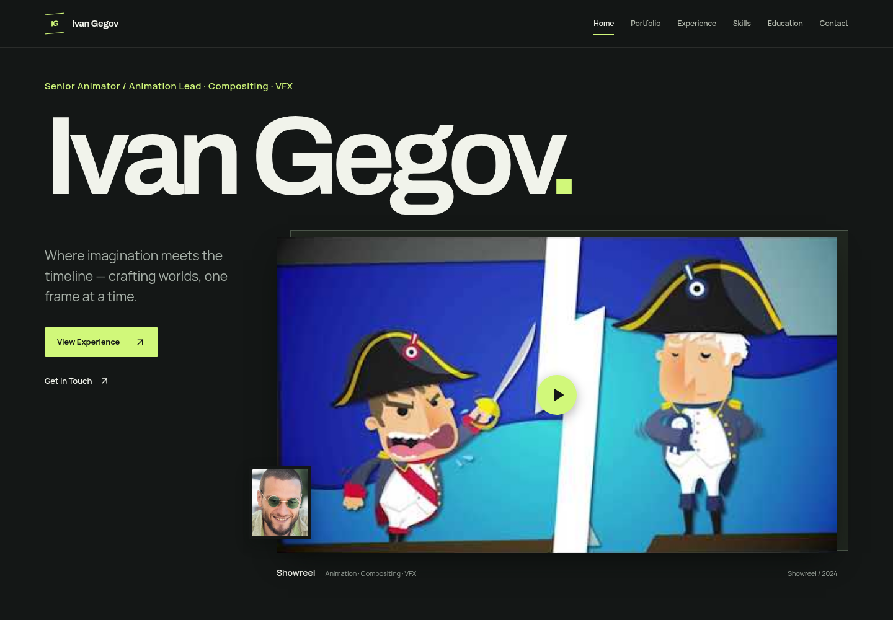

# Senior portfolio redesign

The old opening replaced the existing senior/lead title with an abbreviated discipline line, hid both leadership paragraphs, and presented the portfolio as equal cards. The redesign restores the exact title, makes the biography readable, foregrounds the reel, provides an interactive source contact sheet, and presents career evidence in ledgers.

[Phone opening](redesign/phone.png) · [Projector selection](redesign/projector.png)

## Content integrity

`src/data/cvData.ts` is unchanged. The regression fixture was captured from the provider before editing. Assertions compare exact wording and destinations for nine experience entries, seven portfolio items, all 39 released games, all skill sections and personal skills, four language proficiency levels, both education entries, both biography paragraphs, contact links, availability and footer notices. Role caveats and trademark marks remain. Published CV loading and the editor still use the existing data context.

The existing Bass Boss 2 duplicate URL/poster is preserved. No achievements, metrics, qualifications, project responsibilities or portfolio imagery were invented. Nine existing official poster sources have local WebP delivery copies (956,026 bytes total), with their original data URLs preserved. Archivo and Manrope are served locally with their font licenses.

## Scrollcraft execution

The [brief](../scrollcraft/builds/senior-portfolio/BRIEF.md) is self-authored under the user's explicit creative delegation. The custom production-dossier grammar prioritizes credential navigation and natural reading; the eight stock alternatives and the empty-registry gate are documented there.

The signature is the source contact-sheet projector. Pointer or keyboard selection synchronizes the large source frame, original title/descriptor/year/category and original watch destination. Direct project links remain visible on every contact-sheet label.

Four device families are used: independent hero parallax planes, a short biography entrance, source-frame clip-path reveal, and native horizontal poster pan with explicit controls. Language levels are original static marks. The supplied engine files remain unmodified. A small React lifecycle adapter applies the attribute vocabulary because the standalone engine provides no unmount API; the public stylesheet uses its original tokens and device floor. Essential content is visible before effects initialize.

Intended feeling curve: recognition → intimacy → discovery → confidence → clarity → context → readiness. Cold visual inspection initially read the career as heavy; its row spacing and leading were tightened. The final curve reads recognition → intimacy → discovery → confidence → clarity → context → readiness. The largest visual transformation is the source projector after the quiet biography. The end holds on real contact details and export, with no empty closing frame.

Desktop work occupies the largest section span (3,247px), followed by career (3,044px); all space contains original content. On narrow phones the full career takes more natural-flow height than work because all nine roles remain open. There is no artificial pinning, filler, wheel interception, autoplay or generated imagery.

## Verification

- `npm run lint`, `npm run typecheck`, `npm run test`, `npm run build`: passed. Three unit tests passed.
- `npm run test:smoke`: nine browser tests passed against the production preview. These cover exact content preservation; 320/375/430px navigation, 44px targets and header offsets; all projector selections and arrow/Home/End keyboard input; all game-year filters; native poster movement and focus; vertical page scrolling; JSON Resume download containing nine jobs, seven projects and 39 game credits; and a clearly labelled collection-only published-data fixture with working editor controls and portrait.
- Final production files were opened at `http://localhost:4501`, with six browser contexts: 1440×1000 desktop, 390×844 phone, 360×640 compact phone, 320×740 narrow phone, desktop reduced motion and phone reduced motion. Entry/middle/exit screenshots were captured for every navigable section. No application exceptions, horizontal overflow or broken images after bringing lazy rail images into view.
- The downloadable static archive was extracted and opened independently at `http://localhost:4502`; homepage resources, actual project selection and JSON Resume download worked without application exceptions or failed local resources.
- Scrollcraft's supplied harness completed desktop, phone and reduced-motion runs with six positions per section (37/36/37 unique frames). Contact sheets were visually inspected. It reported no dead scroll. Cue/video checks are inapplicable: essential content is natural flow and there are no scrub clips. Independent tests cover the lifecycle adapter and useful controls.
- At 300px scroll, the three hero planes translate −10.21px, +5.25px and +13.13px. Actual intermediate and selected-project screenshots were inspected; reduced motion retains a complete static composition.
- Axe WCAG A/AA checks at 1440/390/320px reported no violations. Its contrast checker marked offscreen, clipped rail labels for manual review. Their ink/background combinations are shared with the visible labels; secondary text measures 7.47:1 on the work ground. The lowest checked body-text palette pair is 6.03:1 on paper; action labels are 14.97:1.
- All automated contexts disable native pointer lock and capture. The editor panel was raised above navigation, and the public hero heading ID was separated from the editor's Name input ID.

The first supplied-harness attempt stopped before screenshots because the React adapter did not publish its readiness class. The readiness signal was added, and the completed runs supersede that attempt. The first browser inventory incorrectly treated offscreen lazy images as broken; final captures bring each banner into view before checking. These were verification setup issues, not hidden content fixes.

The pre-existing Supabase endpoint is unavailable from this environment (DNS/proxy failure). Real reads were attempted; bundled fallback remains functional. Deterministic tests explicitly abort those reads, and one test separately supplies a labelled synthetic published payload. This does not verify the live database or authenticated administration. No real phone hardware was available; mobile results are Chromium emulation. Existing external video destinations remain unchanged.

## Review and run

The source is on `codex/senior-portfolio-redesign`. Start with `npm install` and `npm run dev`; use `npm run build` and `npm run preview` for the static production output. Optional screenshot reproduction: `node scripts/captureRedesign.mjs http://localhost:4501` while a preview server is running. Generated samples remain under the ignored build `lab` directory.

Only a draft GitHub change is created. The current production deployment is not replaced.
